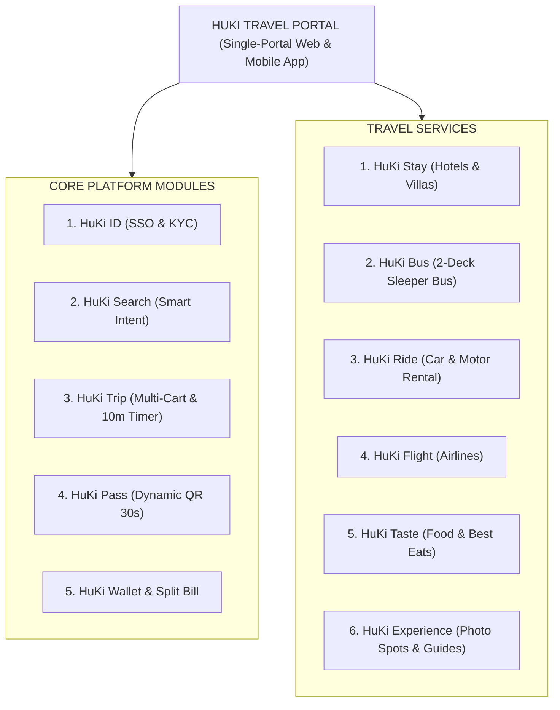

# 🚀 BẢN TỔNG QUAN TOÀN BỘ DỰ ÁN HUKI TRAVEL (MASTER PROJECT SPECIFICATION & ARCHITECTURE BLUEPRINT)

> **Tài liệu tổng hợp phục vụ Agent & Developers tra cứu toàn diện hiện trạng, kiến trúc, luồng chạy nghiệp vụ, tiến độ và định hướng nâng cấp của Hệ sinh thái Du lịch HuKi Travel.**
> **Tác giả**: Huỳnh Gia Huy (`Huy` - Prefix `h-`) & Lê Đức Kiên (`Kiên` - Prefix `k-`) | **HK Team**
> **Phiên bản Master**: v2.0.0 | **Ngày cập nhật**: 11/08/2026

---

## 🏛️ 1. TỔNG QUAN THƯƠNG HIỆU & ĐỊNH VỊ DỰ ÁN (BRAND & ECOSYSTEM OVERVIEW)

- **Tên dự án**: **HuKi Travel** (Thuộc Hệ sinh thái Du lịch "Tất-cả-trong-một" - **HuKi Ecosystem**).
- **Mô hình**: **Super-App Du Lịch Tích Hợp (Unified Single-Portal)** bao gồm 1 Web Application (`web/`) và 1 Mobile Application (`mobile/`).
- **Sứ mệnh hạt nhân**: Gom toàn bộ chuỗi trải nghiệm du lịch (Khách sạn + Xe khách 2 tầng + Thuê xe tự lái + Vé máy bay + Ẩm thực + Điểm check-in + Chia tiền nhóm) vào 1 cổng duy nhất với chiết khấu Combo tiết kiệm 10%.



---

## ⚙️ 2. CHI TIẾT 8 PHÂN HỆ NGHIỆP VỤ CỐT LÕI (CORE BUSINESS MODULES)

| STT | Phân Hệ Dịch Vụ | Chức Năng UI/UX & Nghiệp Vụ Cốt Lõi | Công Nghệ & Luồng Xử Lý Special Cases |
| :--- | :--- | :--- | :--- |
| **1** | **HuKi ID (SSO & KYC)** | Đăng nhập tập trung Google OAuth 2.0 / Phone. Xác thực KYC sinh trắc học, CCCD, Hộ chiếu, GPLX. | Bắt buộc KYC GPLX hợp lệ trước khi duyệt đơn thuê xe tự lái tại HuKi Ride. |
| **2** | **HuKi Stay (Khách sạn)** | Đặt phòng khách sạn, Villa & Resort hạng sang. Bản đồ bán kính GPS, lọc tiện ích. | Quản lý tồn kho phòng `room_inventory` ACID strict trên PostgreSQL. |
| **3** | **HuKi Bus (Xe khách)** | Sơ đồ xe giường nằm 2 tầng (`seatMap`) chọn vị trí đón/trả real-time. | Khóa ghế tạm thời 10 phút chống đặt trùng (Overbooking) bằng Redis Redlock & WebSocket. |
| **4** | **HuKi Ride (Thuê xe)** | Thuê xe máy, ô tô tự lái giao tận nơi / sân bay. Upload bằng lái GPLX. | Chặn tiến trình nếu chưa KYC GPLX trên HuKi ID $\rightarrow$ Mở Popup chụp xác thực tức thì. |
| **5** | **HuKi Trip (Combo Cart)** | Giỏ hàng chuyến đi đa dịch vụ lồng nhau (Flight + Hotel + Bus + Ride). | Tự động tính chiết khấu Combo 10%. Đếm ngược thời gian giữ chỗ tập trung (Global Countdown Timer 10-15m). |
| **6** | **HuKi Pass (Ví vé QR)** | Quản lý tất cả vé đã mua, cấp mã QR động tự đổi token mỗi 30 giây. | Chống chụp màn hình bán vé giả khi lên xe khách hoặc nhận phòng. |
| **7** | **HuKi Wallet & Split Bill** | Nhập khoản chi tiêu chuyến đi nhóm, quản lý ví điểm thưởng. | Thuật toán hạch toán nợ chéo (Reconciliation Algorithm) tối thiểu hóa số lượt chuyển khoản. |
| **8** | **HuKi Guide & Taste** | Cẩm nang du lịch, bản đồ ẩm thực đặc sản địa phương & điểm sống ảo. | Tự động gợi ý liên kết vé xe/khách sạn trong nội dung bài viết. |

---

## 🏗️ 3. KIẾN TRÚC KỸ THUẬT & STACK CÔNG NGHỆ (FULL-STACK ARCHITECTURE)

### 🔹 A. Frontend Web Application (`web/`):
- **Core Framework**: Next.js (App Router), React, TypeScript.
- **State Management & Data Fetching**: Zustand, TanStack Query.
- **Styling**: Vanilla CSS chuẩn hóa Design System Tokens (`web/src/app/globals.css`), Glassmorphism.
- **Multi-Language Engine (i18n)**: Tích hợp trọn bộ **10 Ngôn Ngữ Toàn Cầu** (`vi`, `en`, `ko`, `ja`, `th`, `zh`, `fr`, `de`, `es`, `ru`) với Quy tắc Bảo tồn Tên riêng Địa danh Gốc (`Sydney`, `Tokyo`, `Đà Nẵng`...).

### 🔹 B. Backend Microservices Platform (`platform/`):
- **Runtime & Gateway**: Node.js, Express, Module **API Gateway Service Discovery** (`platform/src/gateway/gateway.router.js`).
- **Inter-Service Communication**:
  - *Synchronous*: gRPC (Protocol Buffers) cho giao tiếp đồng bộ tốc độ cao.
  - *Asynchronous*: RabbitMQ / Kafka cho kiến trúc Event-Driven (`PaymentCompleted`, `HoldTimerExpired`).
- **Concurrency & Locking**: Redis Redlock khóa vị trí ghế/phòng chống Overbooking. Thuật toán Saga Pattern cho giao dịch đền bù Combo.

### 🔹 C. Mô Hình Dữ Liệu Đa Tầng (Polyglot Persistence):
```text
┌─────────────────────────────────────────────────────────────────────────┐
│                        HUKI API GATEWAY (Port 4000)                     │
└─────┬──────────────────┬──────────────────┬──────────────────┬──────────┘
      │ (Auth)           │ (Stay/Payment)   │ (Bus/Ride/Trip)  │ (Cache/Lock)
      ▼                  ▼                  ▼                  ▼
┌──────────────┐   ┌──────────────┐   ┌──────────────┐   ┌──────────────┐
│  PostgreSQL  │   │  PostgreSQL  │   │MongoDB Atlas │   │ Redis Cluster│
│ (Users & KYC)│   │ (Hotels/Pay) │   │(Trips/Seats) │   │(Hold/Redlock)│
└──────────────┘   └──────────────┘   └──────────────┘   └──────────────┘
```

---

## 📊 4. TIẾN ĐỘ THỰC THI & CÁC ĐỀ XUẤT ĐÃ HOÀN THÀNH (PROJECT PROGRESS & BENCHMARKS)

| Mã Đề Xuất | Tác Giả | Mã Result | Trạng Thái | Tóm Tắt Kết Quả Đã Bàn Giao |
| :--- | :--- | :--- | :--- | :--- |
| `h-dexuat-0000.md` | Huy | - | ✅ HOÀN THÀNH | Chuẩn hóa Hệ thống Quy tắc Master Enterprise Rules & Phân biên tác giả `h-`/`k-`. |
| `h-dexuat-0001.md` | Huy | `h-result-0001.md` | ✅ HOÀN THÀNH | Tích hợp CSDL Kép PostgreSQL + MongoDB Atlas & Express RESTful APIs. Đã fix Prisma v7.x Driver Adapter Singleton (`platform/src/config/prisma.config.js`). |
| `h-dexuat-0002.md` | Huy | `h-result-0002.md` | ✅ HOÀN THÀNH | Chuẩn hóa API Gateway & Microservices Service Discovery Module (`platform/src/gateway/gateway.router.js`) định tuyến 5 microservices. |
| `h-dexuat-0003.md` | Huy | `h-result-0003.md` | ✅ HOÀN THÀNH | Chuẩn hóa i18n 10 Ngôn ngữ Toàn cầu cho Trang chủ & Toàn bộ Web App. Re-design Ô chọn Header popover 10 cờ. Fix lỗi vỡ chữ Tiếng Hàn/Nhật (`white-space: nowrap`). Chuyển thư mục script test tái sử dụng vào `docs/scripts/test-i18n-darkmode.js`. |

---

## 📜 5. QUY TRÌNH LÀM VIỆC & CÚ PHÁP LỆNH HK TEAM (AGENT PROTOCOL)

AI phân tích câu lệnh của người dùng để xác định đúng Tác Giả (`h-` cho Huy, `k-` cho Kiên) và Chế độ hoạt động:

1. **`h-đề xuất` / `k-đề xuất` (PROPOSAL MODE)**: Phân tích & lập kế hoạch (Tự động tăng mã `000n` / `100n`). **TUYỆT ĐỐI KHÔNG SỬA CODE**.
2. **`h-thống nhất` / `k-thống nhất` (EXECUTION MODE)**: Viết code, cập nhật DB & xuất file kết quả `docs/results/h-result-000n.md` / `k-result-100n.md`.
3. **`h-fix` / `k-fix` (FIX ERROR & APPEND MODE)**: Sửa lỗi code, ghi bổ sung vào result cũ & append log sự cố vào duy nhất [`docs/errors/error.md`](docs/errors/error.md). KHÔNG tạo file đề xuất/kết quả mới.
4. **`h-kiểm tra` / `k-kiểm tra` (CHECK MODE)**: Audit syntax, kết nối DB, server status.
5. **`h - thêm rule` / `k - thêm rule` (ADD RULE MODE)**: Thêm quy tắc mới trực tiếp vào file `@file` chỉ định (hoặc `AGENTS.md`).
6. **`h-cập nhật rule` / `k-cập nhật rule` (UPDATE RULE IN-PLACE MODE)**: Dò tìm quy tắc cũ đã có trong file và **CẬP NHẬT TRỰC TIẾP TẠI CHỖ**, không tạo trùng lặp.

---

## 💡 6. ĐỊNH HƯỚNG ĐỀ XUẤT NÂNG CẤP TIẾP THEO (BEST NEXT RECOMMENDATIONS)

1. **Tối ưu Kiến trúc Inter-Service gRPC & Event Broker**:
   - Khởi tạo gRPC Protobuf definitions cho việc truy vấn tồn kho khách sạn (`huki-stay-service`) và đặt vé xe (`huki-bus-service`) từ `huki-trip-service`.
2. **Triển khai Trình Đếm Giữ Chỗ Tập Trung (Global Hold Timer & Redlock)**:
   - Xây dựng Redis Key Space Notifications tự động giải phóng chỗ khi đếm ngược 10 phút hết hạn.
3. **Đóng Gói Docker Microservices & Orchestration**:
   - Tạo file `Dockerfile` riêng biệt cho từng dịch vụ backend và file `docker-compose.yml` chạy đồng bộ local dev environment.
