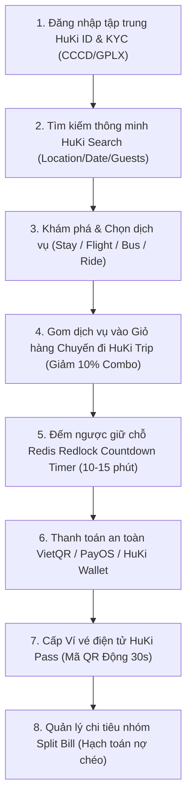

# Sơ Đồ & Tài Liệu Luồng Chạy Nghiệp Vụ HuKi Travel (Enterprise Master Business Flow)

## 🗺️ 1. LUỒNG TRẢI NGHIỆM CHUẨN END-TO-END (HAPPY CASE JOURNEY)

---

## 📋 2. CHI TIẾT 8 PHÂN HỆ NGHIỆP VỤ CHO DOANH NGHIỆP

1. **Phân hệ HuKi ID (SSO & KYC)**:
   - Đăng nhập tập trung bằng Google OAuth 2.0 / Email / Phone.
   - Xác thực sinh trắc học & thông tin KYC (CCCD, Hộ chiếu, GPLX) chuẩn hóa cho thuê xe & bảo mật.

2. **Phân hệ HuKi Stay (Đặt phòng Khách sạn & Villa)**:
   - Tìm kiếm theo vị trí GPS (PostGIS Spatial Indexing), xem sơ đồ phòng, tiện ích và đặt phòng với thuật toán khoá phòng thời gian thực.

3. **Phân hệ HuKi Bus (Đặt vé xe khách 2 tầng)**:
   - Sơ đồ ghế giường nằm 2 tầng real-time, khóa ghế tạm thời 10 phút chống đặt trùng ghế (Overbooking).

4. **Phân hệ HuKi Ride (Thuê xe máy & ô tô tự lái)**:
   - Đặt xe giao tận nơi/sân bay, tự động kiểm tra bằng lái GPLX hợp lệ trên HuKi ID trước khi duyệt đơn.

5. **Phân hệ HuKi Trip (Giỏ hàng chuyến đi đa dịch vụ)**:
   - Gom vé bay + khách sạn + xe khách + thuê xe vào 1 Chuyến đi duy nhất, tự động tính chiết khấu Combo tiết kiệm 10%.

6. **Phân hệ HuKi Pass (Ví vé & QR Động)**:
   - Quản lý tất cả vé đã mua, cấp mã QR động tự đổi token mỗi 30 giây chống chụp màn hình bán vé giả.

7. **Phân hệ HuKi Wallet & Split Bill (Chia tiền chuyến đi nhóm)**:
   - Nhập các khoản chi tiêu khi đi du lịch nhóm, tự động hạch toán nợ chéo và tối thiểu hóa số lần chuyển tiền giữa các thành viên.

8. **Phân hệ HuKi Guide (Cẩm nang du lịch & Điểm đến)**:
   - Gợi ý di sản, di tích, địa điểm ẩm thực check-in hot kèm bản đồ tương tác.
