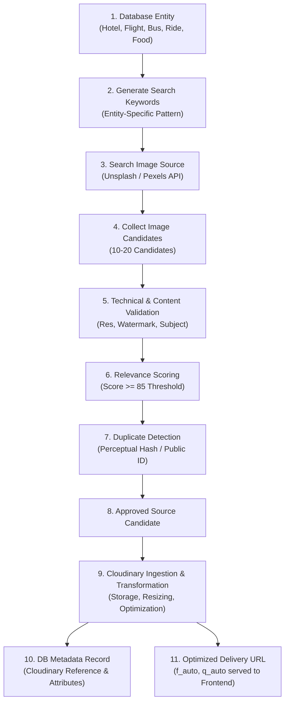
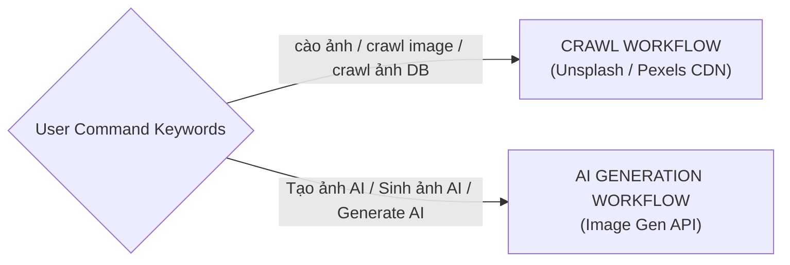

# HuKi Travel Ecosystem - Image Asset Specification & Asset Pipeline

> **Document Type**: Production Technical Specification & Agent Execution Blueprint  
> **Target File**: `docs/db/promt.img.md`  
> **Author**: Huỳnh Gia Huy (`Huy`) | HK Team  
> **Role**: Senior Database Architect & Asset Pipeline Engineer  
> **Status**: APPROVED PRODUCTION SPECIFICATION

---

## 1. ARCHITECTURE & IMAGE PIPELINE SPECIFICATION

The HuKi Travel Ecosystem enforces a strict **Decoupled Image Asset Pipeline**. Image assets MUST NOT be directly served to frontend clients using raw third-party source URLs if they have been ingested into the managed storage pipeline.



### 1.1 Architectural Responsibilities

- **Image Source (Unsplash / Pexels)**: Used strictly for **Discovery & Ingestion Sourcing**. Raw CDN URLs from sources serve as temporary `source_image_url` candidates during processing.
- **Image Storage & CDN (Cloudinary)**: Responsible for permanent asset storage, security, transformation, aspect ratio cropping, format conversion (`f_auto`), and quality optimization (`q_auto`).
- **Database (PostgreSQL / MongoDB)**: Stores asset metadata, entity relationships, operational tags, and Cloudinary references (`cloudinary_public_id`, `cloudinary_url`).
- **Frontend (Web / Mobile App)**: MUST consume Cloudinary Delivery URLs ONLY. Direct rendering of raw third-party source URLs for managed assets is PROHIBITED once ingested.

---

## 2. PRODUCTION RESOLUTION & 4K SPECIFICATION

The term "4K Target" specifies the **Source Ingestion Quality Ceiling**, NOT the forced delivery payload size for all client viewports.

### 2.1 Ingestion Resolution Ceiling (Source Target)
- **Hero / Banner / Cover**: Source image width MUST be $\ge 2560\text{px}$ (Targeting 4K / 2K source quality).
- **Card / Gallery / Interior**: Source image width SHOULD be $\ge 1920\text{px}$.
- **Avatar / Logo**: Source image width MUST be $\ge 400\text{px}$.

### 2.2 Dynamic Cloudinary Delivery Contexts
Delivery payloads MUST be dynamically scaled by Cloudinary based on the UI display context. Hard-coding 4K payloads for thumbnail or card views is PROHIBITED.

| UI Display Context | Target Delivery Width | Recommended Cloudinary Transformation Flags |
| :--- | :--- | :--- |
| **Hero / Banner (Desktop)** | `~1920px` | `c_fill,w_1920,f_auto,q_auto` |
| **Room / Detail View** | `~1200px` | `c_fill,w_1200,f_auto,q_auto` |
| **Food / Detail Item** | `~1000px` | `c_fill,w_1000,f_auto,q_auto` |
| **Card / Grid Item (Desktop)** | `~800px` | `c_fill,w_800,f_auto,q_auto` |
| **Mobile Card / Grid** | `~600px` | `c_fill,w_600,f_auto,q_auto` |
| **Avatar / Logo / Badge** | `~400px` | `c_fill,w_400,h_400,g_face,f_auto,q_auto` |

---

## 3. ASPECT RATIO STANDARDS

Assets MUST conform to defined aspect ratio constraints per entity role. Cloudinary focal crop (`g_auto`) MUST be applied to prevent truncating primary subjects.

| Service / Entity Role | Standard Aspect Ratio | Cloudinary Crop Flag | Primary Focal Point |
| :--- | :--- | :--- | :--- |
| **Hero / Banner / Cover** | `16:9` or `21:9` | `c_fill,ar_16:9,g_auto` | Center Horizon / Landmark |
| **Card / List Item** | `4:3` or `16:10` | `c_fill,ar_4:3,g_auto` | Main Vehicle / Room Center |
| **Room Interior** | `4:3` | `c_fill,ar_4:3,g_auto` | Bed / Interior Space |
| **Food / Specialty** | `4:3` | `c_fill,ar_4:3,g_center` | Dish Center |
| **Destination / Experience** | `16:9` | `c_fill,ar_16:9,g_auto` | Landscape Landmark |
| **Avatar / Logo / Badge** | `1:1` | `c_fill,ar_1:1,g_face` | Face / Brand Emblem |

---

## 4. STRICT SUBJECT RELEVANCE SPECIFICATIONS

Crawled assets MUST strictly match domain subject criteria. Inaccurate subject assignment is treated as a critical validation failure.

- **HuKi Stay (`huki-stay-service`)**:
  - MUST match entity property type (Hotel, Villa, Resort, Homestay).
  - MUST NOT assign generic hotel photos from a different property just because they share a city.
  - Room images MUST correspond to room category if specified (Suite, Deluxe, Single).

- **HuKi Bus (`huki-bus-service`)**:
  - MUST be modern 2-deck sleeper buses (Sleeper Bus / VIP Limousine Bus).
  - MUST NOT be city transit buses, school buses, cargo trucks, or standard short-distance coaches.

- **HuKi Ride (`huki-ride-service`)**:
  - MUST match exact vehicle category (SUV, Sedan, Scooter, Motorbike).
  - MUST be pristine catalog-quality or travel-setting photos.
  - MUST NOT contain damaged vehicles, accident scenes, or junk yards.

- **HuKi Flight (`huki-flight-service`)**:
  - MUST be commercial passenger aircraft (Boeing, Airbus, ATR) or luxury airliner cabins.
  - MUST NOT contain military aircraft, fighter jets, cargo planes, or toy models.

- **HuKi Taste (`huki-taste-service`)**:
  - MUST be high-end close-up food photography of the specified dish.
  - MUST NOT use generic empty restaurant seating as food item images.

- **HuKi Experience (`huki-experience-service`)**:
  - MUST display the exact landmark or attraction specified by the destination entity.
  - MUST NOT use generic scenery from a different province/city.

---

## 5. WORKFLOW SEPARATION: CRAWL VS. AI GENERATION

The crawler pipeline and AI image generation pipeline are strictly decoupled.



### 5.1 Crawl Workflow Trigger Rules
- **Triggers**: Commands containing `"cào ảnh"`, `"crawl image"`, `"lấy ảnh mạng"`, `"crawl ảnh cho DB"`.
- **Execution Policy**: Agent MUST ONLY execute the Web Asset Crawler Pipeline (Unsplash / Pexels Sourcing).
- **Prohibition**: Agent MUST NOT trigger AI Image Generation APIs when executing a crawl command.

### 5.2 AI Generation Workflow Trigger Rules
- **Triggers**: Commands explicitly containing `"Tạo ảnh AI"`, `"Sinh ảnh AI"`, `"Generate AI image"`.
- **Execution Policy**: Agent MAY execute AI generation prompts using authorized generative tools.

---

## 6. CANDIDATE SELECTION & SCORING MATRIX

Agent MUST NOT blindly select the first image returned by search queries. A candidate pool of **10 to 20 images** MUST be collected and evaluated against the scoring matrix.

```
Candidate Score = (Relevance * 0.40) + (Resolution * 0.15) + (Quality * 0.15) + (Aspect * 0.10) + (Cleanliness * 0.10) + (Uniqueness * 0.10)
```

| Evaluation Dimension | Weight | Criteria & Thresholds |
| :--- | :--- | :--- |
| **Subject Relevance** | **40%** | Exact match with entity domain, category, and subject context. |
| **Resolution & Clarity** | **15%** | Meets source resolution target ($\ge 2560\text{px}$ for Hero, $\ge 1920\text{px}$ for Card). |
| **Visual Quality & Lighting** | **15%** | Professional lighting, warm/vibrant tones, high dynamic range. |
| **Aspect Ratio Fit** | **10%** | Native composition adapts cleanly to required target ratio. |
| **Cleanliness & Watermark** | **10%** | Free of visible stock watermarks, text overlays, and promo banners. |
| **Uniqueness** | **10%** | Distinct perceptual hash; not previously assigned in system. |

### 6.1 Approval Gates
- **Score $\ge 85$**: **APPROVED** (Eligible for Cloudinary ingestion).
- **Score $70 - 84$**: **NEED_REVIEW** (Requires manual verification before ingestion).
- **Score $< 70$**: **REJECTED** (Discard candidate).
- **Hard Gate Rule**: If **Subject Relevance $< 35 / 40$**, the candidate MUST be **REJECTED IMMEDIATELY**, regardless of high scores in other categories.

---

## 7. DUPLICATE DETECTION & UNIQUENESS

To prevent visual monotony across thousands of database entities:
- Agent MUST track `source_image_id`, `source_image_url`, and `cloudinary_public_id`.
- Reusing the exact same source asset across multiple distinct database entities MUST NOT occur when alternative unique candidates scoring $\ge 85$ are available.

---

## 8. WATERMARK & PLACEHOLDER REJECTION STANDARDS

Candidates matching any of the following criteria MUST be rejected unconditionally:
1. Visible stock photo watermarks or photographer attribution text overlays.
2. Low-resolution, blurry, pixelated, or compressed artifacts.
3. Website screenshots, promotional advertisement banners, or text-heavy graphics.
4. Generic grey placeholders or empty 3D clay renders.
5. Damaged or off-domain subjects.

*Exception*: Official corporate/partner logos for verified business profiles (`business_profiles`) are exempt from logo rejection rules.

---

## 9. PEOPLE PROMINENCE POLICY

- **Preference 1**: Clean subject photos with zero human presence.
- **Preference 2**: Background human presence with depth-of-field blur (Bokeh effect).
- **Preference 3 (Travel Scenery)**: Natural human scale presence in landscape photos, provided the primary landmark is unobstructed.
- **Prohibition**: Prominent close-up human faces taking up $> 30\%$ of frame area are PROHIBITED for entity cover/card assets (excluding user avatar entities).

---

## 10. CLOUDINARY ARCHITECTURE & PUBLIC ID CONVENTIONS

Assets ingested into Cloudinary MUST strictly adhere to predictable folder and public ID naming patterns.

### 10.1 Folder Structure
```text
huki/
├── stay/
│   └── hotels/{entityId}/
├── bus/
│   └── operators/{entityId}/
├── ride/
│   └── vehicles/{entityId}/
├── flight/
│   └── airlines/{entityId}/
├── taste/
│   └── foods/{entityId}/
├── experience/
│   └── destinations/{entityId}/
└── business/
    └── logos/{entityId}/
```

### 10.2 Public ID Naming Convention
- Cover Image: `huki/{service}/{category}/{entityId}/cover`
- Hero Image: `huki/{service}/{category}/{entityId}/hero`
- Gallery Item: `huki/{service}/{category}/{entityId}/gallery-{index}`
- Avatar / Logo: `huki/business/logos/{entityId}/avatar`

---

## 11. DATABASE IMAGE METADATA STANDARD

Database tables or collections referencing image assets SHOULD support the following unified metadata structure.

```sql
-- Standard Metadata Reference Blueprint
entity_type          VARCHAR(30) NOT NULL, -- HOTEL, ROOM, BUS, RIDE, FLIGHT, FOOD, DESTINATION, BUSINESS
entity_id            VARCHAR(64) NOT NULL,
image_role           VARCHAR(20) NOT NULL, -- cover, hero, banner, thumbnail, gallery, interior, exterior, room, avatar, logo
source_type          VARCHAR(20) NOT NULL, -- UNSPLASH, PEXELS, AI_GENERATED, USER_UPLOADED, OTHER
source_url           TEXT,                 -- Origin page URL
source_image_url     TEXT,                 -- Raw direct CDN candidate URL
cloudinary_public_id VARCHAR(150),         -- Cloudinary Public ID
cloudinary_url        TEXT NOT NULL,        -- Primary delivery URL for Frontend
width                INT,
height               INT,
aspect_ratio         VARCHAR(10),
is_primary           BOOLEAN DEFAULT FALSE,
created_at           TIMESTAMP DEFAULT CURRENT_TIMESTAMP
```

---

## 12. SEARCH KEYWORD STRATEGY PER SERVICE

Search queries sent to image sources MUST be constructed using specific entity attributes. Generic single-word searches are PROHIBITED.

| Service | Prohibited Generic Search | Mandatory Specific Search Pattern |
| :--- | :--- | :--- |
| **HuKi Stay** | `"hotel Vietnam"` | `"{hotel_name} {city} Vietnam resort interior luxury"` |
| **HuKi Bus** | `"bus"` | `"VIP 2 deck sleeper bus limousine interior transport"` |
| **HuKi Ride** | `"car"` | `"{vehicle_make} {vehicle_model} luxury car automotive"` |
| **HuKi Flight** | `"airplane"` | `"{airline_name} {aircraft_model} commercial airplane takeoff sunset"` |
| **HuKi Taste** | `"food Vietnam"` | `"{food_dish_name} Vietnamese authentic cuisine food photography"` |
| **HuKi Experience**| `"Da Nang"` | `"{landmark_name} {city} Vietnam landmark scenic high resolution"` |

---

## 13. CRAWLER ERROR HANDLING PROTOCOL

1. **Dead Source URL**: Discard candidate immediately; move to next candidate in pool.
2. **Resolution Under Threshold**: Discard candidate.
3. **Off-Subject Candidate**: Discard candidate.
4. **Duplicate Detected**: Discard candidate or fetch fallback candidate.
5. **Cloudinary Upload Failure**: Retain asset candidate in `PENDING_RETRY` queue; do NOT flag as `APPROVED`.
6. **Database Persistence Failure**: Log error and retain `cloudinary_public_id` to avoid duplicate Cloudinary uploads during retry cycles.

---

## 14. AI GENERATION WORKFLOW (STANDALONE SPECIFICATION)

When explicitly triggered by AI generation commands (`"Tạo ảnh AI"` / `"Sinh ảnh AI"`):
1. Construct prompts emphasizing 4K resolution, realistic textures, volumetric lighting, and exact subject specs.
2. Store output in Cloudinary under `huki/ai_generated/{service}/{entityId}/`.
3. Record `source_type = 'AI_GENERATED'` in database metadata.

---

## 15. SOURCE IMAGE CATALOG (VERIFIED CANDIDATE STORAGE)

The following candidate metadata records represent pre-verified source candidates. They serve as valid `source_image_url` inputs for asset ingestion into Cloudinary.

| Asset Key | Service Domain | Source Provider | Source Image Candidate URL | Recommended Role | Target Aspect Ratio | Subject Description |
| :--- | :--- | :--- | :--- | :--- | :--- | :--- |
| `flight_boeing_takeoff` | `HuKi Flight` | Unsplash | `https://images.unsplash.com/photo-1540959733332-eab4deabeeaf?auto=format&fit=crop&w=2560&q=80` | `hero` | `16:9` | Commercial Boeing 787 taking off above clouds at golden hour sunrise |
| `flight_business_cabin` | `HuKi Flight` | Unsplash | `https://images.unsplash.com/photo-1512100356356-de1b84283e18?auto=format&fit=crop&w=2560&q=80` | `interior` | `16:10` | Modern airliner Business Class cabin with lie-flat pod seats |
| `flight_airbus_landing` | `HuKi Flight` | Unsplash | `https://images.unsplash.com/photo-1436491865332-7a61a109cc05?auto=format&fit=crop&w=2560&q=80` | `cover` | `16:9` | Airbus A350 passenger airliner on landing approach at sunset |
| `flight_commercial_jet` | `HuKi Flight` | Unsplash | `https://images.unsplash.com/photo-1569154941061-e231b4725ef1?auto=format&fit=crop&w=2560&q=80` | `gallery` | `16:9` | Commercial jetliner fuselage climbing into clear blue sky |
| `flight_wing_clouds` | `HuKi Flight` | Unsplash | `https://images.unsplash.com/photo-1499346321255-7469d2db6ceb?auto=format&fit=crop&w=2560&q=80` | `banner` | `16:9` | Airplane wing view above sea of fluffy clouds |
| `flight_first_class` | `HuKi Flight` | Unsplash | `https://images.unsplash.com/photo-1540555700478-4be289fbecef?auto=format&fit=crop&w=2560&q=80` | `interior` | `4:3` | Luxury First Class private suite seating in commercial plane |
| `stay_resort_ocean` | `HuKi Stay` | Unsplash | `https://images.unsplash.com/photo-1566073771259-6a8506099945?auto=format&fit=crop&w=2560&q=80` | `cover` | `16:9` | Luxury 5-star beachfront resort infinity pool overlooking ocean |
| `stay_room_deluxe` | `HuKi Stay` | Unsplash | `https://images.unsplash.com/photo-1618773928121-c32242e63f39?auto=format&fit=crop&w=2560&q=80` | `room` | `4:3` | Deluxe hotel bedroom suite with king bed and warm wooden lighting |
| `bus_sleeper_vip` | `HuKi Bus` | Unsplash | `https://images.unsplash.com/photo-1544620347-c4fd4a3d5957?auto=format&fit=crop&w=2560&q=80` | `cover` | `16:9` | Modern 2-deck VIP sleeper bus cruising on highway |
| `ride_suv_car` | `HuKi Ride` | Unsplash | `https://images.unsplash.com/photo-1533473359331-0135ef1b58bf?auto=format&fit=crop&w=2560&q=80` | `cover` | `16:9` | Brand new white SUV rental car parked at scenic mountain road |
| `ride_scooter` | `HuKi Ride` | Unsplash | `https://images.unsplash.com/photo-1558981806-ec527fa84c39?auto=format&fit=crop&w=2560&q=80` | `thumbnail` | `4:3` | Modern rental scooter parked along coastal palm tree road |
