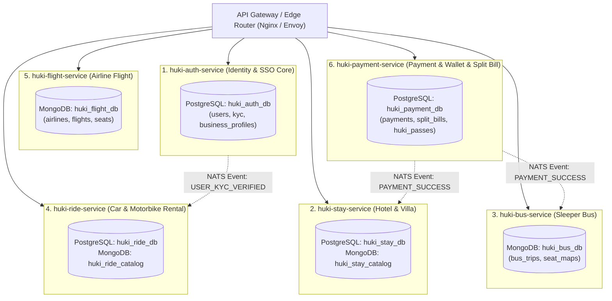

# Mã Đề Xuất: h-dexuat-0001
**Dự án**: StayZ platform & DB Upgrade to HuKi Travel Ecosystem
**Tiêu đề**: Bản Thiết Kế Chi Tiết & Chuẩn Hóa CSDL Dài Hạn (PostgreSQL + MongoDB Atlas) & Nâng Cấp Platform Microservices Architecture Cho Hệ Sinh Thái HuKi Travel v2.0
**Trạng thái**: ĐÃ CẬP NHẬT KIẾN TRÚC PHÂN TÁCH CSDL & MICROSERVICES (PROPOSAL MODE — CHỈ LẬP KẾ HOẠCH, KHÔNG SỬA CODE NGUỒN)

---

## 📋 1. TỔNG QUAN ĐỀ XUẤT CHUYỂN ĐỔI (OVERVIEW)

Theo định hướng kiến trúc từ bộ tài liệu **HuKi Travel Master Architecture Specification v2.0** (`HuKi Travel/`), hệ thống Backend Platform (`platform/`) và CSDL (Prisma PostgreSQL + Mongoose MongoDB) của StayZ sẽ được tái cấu trúc và nâng cấp mở rộng từ **Đơn dịch vụ Khách sạn (StayZ)** thành **Super-App Du Lịch Đa Dịch Vụ (HuKi Travel)** theo chuẩn kiến trúc Microservices phân tách độc lập.

---

## 🗄️ 2. KẾ HOẠCH NÂNG CẤP CƠ SỞ DỮ LIỆU (DATABASE SPECIFICATION)

### 🔹 A. Nâng Cấp CSDL Relational (Prisma Schema - `platform/prisma/schema.prisma`)

1. **Bảng `users` (Nâng cấp thành HuKi ID & Phân hệ KYC)**:
   - Thêm cột `identity_card_number` (CCCD), `passport_number` (Hộ chiếu), `driver_license_number` (GPLX).
   - Thêm cột `kyc_status` (`UNVERIFIED`, `PENDING`, `VERIFIED`), `driver_license_image_url`.

2. **Bảng `bookings` (Nâng cấp thành Universal Trip Order)**:
   - Thêm cột `booking_type` (`STAY`, `FLIGHT`, `BUS`, `RIDE`, `COMBO_TRIP`).
   - Thêm cột `hold_expires_at` (Thời gian đếm ngược giữ chỗ Redis Redlock Countdown Timer - 10 đến 15 phút).

3. **Tạo Bảng Mới `split_bill_expenses` & `split_bill_shares` (Phân hệ HuKi Wallet & Split Bill)**:
   - `split_bill_expenses`: Thêm các khoản chi tiêu chuyến đi nhóm (`trip_id`, `payer_id`, `amount`, `description`, `split_method`).
   - `split_bill_shares`: Quản lý nợ chéo từng thành viên (`expense_id`, `user_id`, `owed_amount`, `is_settled`).

---

### 🔹 B. Nâng Cấp CSDL NoSQL MongoDB Atlas (`platform/src/models/`)

1. **[NEW] `trips.model.js` (Universal Trip Cart)**:
   - Lưu giỏ hàng Chuyến đi đa dịch vụ lồng nhau (Flight + Hotel + Bus + Ride).
   - Quản lý trạng thái `HOLDING` / `PAID` / `EXPIRED` cùng thời gian giải phóng tự động.

2. **[NEW] `busTrips.model.js` (Sơ Đồ Ghế Xe Khách 2 Tầng - Real-time SeatMap)**:
   - Lưu cấu trúc sơ đồ ghế giường nằm (`seatMap` array: `seatNo`, `deck`, `status: AVAILABLE/LOCKED/BOOKED`, `lockedByUserId`, `lockExpiresAt`).

3. **[NEW] `rides.model.js` (Danh Mục Xe Máy / Ô Tô Thuê Tự Lái)**:
   - Lưu danh sách phương tiện, điểm giao xe tận nơi, yêu cầu KYC bằng lái xe GPLX.

4. **[NEW] `hukiPass.model.js` (Ví Vé & Mã QR Động)**:
   - Lưu E-Ticket kèm mã token QR động làm mới mỗi 30 giây chống chụp màn hình bán vé giả.

---

## 🛠️ 3. KẾ HOẠCH NÂNG CẤP BACKEND PLATFORM (`platform/src/`)

| Phân hệ / Module | Đường dẫn File | Mục Đích & Hạng Mục Chỉnh Sửa |
| :--- | :--- | :--- |
| **Server Main** | `platform/server.js` | Tích hợp Route mới `/api/v1/huki`, bổ sung Socket.io namespace cho ghế xe khách & Redis Redlock lock service. |
| **HuKi ID Auth** | `src/controllers/auth.controller.js`<br>`src/routes/auth.routes.js` | Bổ sung API cập nhật hồ sơ KYC (CCCD, Passport, GPLX) và xác thực tài khoản tập trung. |
| **Universal Trip** | `src/controllers/trip.controller.js`<br>`src/routes/trip.routes.js` | [NEW] API Tạo giỏ hàng chuyến đi đa dịch vụ, tính toán tổng tiền Combo tiết kiệm và đếm ngược giữ chỗ. |
| **Bus Service** | `src/controllers/bus.controller.js`<br>`src/routes/bus.routes.js` | [NEW] API Tìm kiếm tuyến xe, tải sơ đồ ghế 2 tầng real-time và khóa ghế tạm thời 10 phút via Redis Redlock. |
| **Ride Service** | `src/controllers/ride.controller.js`<br>`src/routes/ride.routes.js` | [NEW] API Đặt thuê xe máy/ô tô, tự động kiểm tra trạng thái KYC bằng lái xe trước khi duyệt đơn. |
| **Split Bill** | `src/controllers/splitbill.controller.js`<br>`src/routes/splitbill.routes.js` | [NEW] API Tạo nhóm chuyến đi, nhập khoản chi tiêu và chạy thuật toán tối thiểu hóa số lượt chuyển khoản nợ chéo. |

---

## 📑 4. DANH SÁCH FILE ĐÃ THỰC HIỆN

```text
platform/
├── prisma/
│   └── schema.prisma                      # [MODIFY] Thêm KYC, Universal Booking, Split Bill Tables
├── src/
│   ├── models/
│   │   ├── trips.model.js                 # [NEW] MongoDB Schema cho Universal Trip Cart
│   │   ├── busTrips.model.js              # [NEW] MongoDB Schema cho Sơ đồ ghế xe khách real-time
│   │   ├── rides.model.js                 # [NEW] MongoDB Schema cho Xe thuê
│   │   └── hukiPass.model.js              # [NEW] MongoDB Schema cho Mã QR Động
│   ├── controllers/
│   │   ├── auth.controller.js             # [MODIFY] Thêm API KYC
│   │   ├── trip.controller.js             # [NEW] Controller quản lý chuyến đi
│   │   ├── bus.controller.js              # [NEW] Controller sơ đồ ghế & đặt vé xe
│   │   ├── ride.controller.js             # [NEW] Controller thuê xe
│   │   └── splitbill.controller.js        # [NEW] Controller chia tiền nhóm
│   ├── routes/
│   │   ├── auth.routes.js                 # [MODIFY] Thêm router KYC
│   │   ├── trip.routes.js                 # [NEW] Route /api/v1/huki/trips
│   │   ├── bus.routes.js                  # [NEW] Route /api/v1/huki/bus
│   │   ├── ride.routes.js                 # [NEW] Route /api/v1/huki/ride
│   │   └── splitbill.routes.js            # [NEW] Route /api/v1/huki/wallet/split-bill
│   └── server.js                          # [MODIFY] Đăng ký các Route Huki mới
```

---

## ➕ 5. ĐỀ XUẤT BỔ SUNG (NÂNG CẤP CHUYỂN ĐỔI MySQL ➔ PostgreSQL)

### 📊 Đánh Giá Tính Khả Thi & Lợi Ích:
Chuyển đổi từ **MySQL $\rightarrow$ PostgreSQL** là một quyết định **CỰC KỲ ỔN ĐỊNH VÀ ĐÚNG ĐẮN 100%**:

1. **Khớp 100% với Chuẩn Kiến Trúc HuKi Master Spec v2.0**:
   - Tài liệu thiết kế v2.0 (`HuKi Travel/`) đã chọn **PostgreSQL** làm RDBMS hạt nhân cho Auth & Transactions.
2. **PostGIS (Spatial Indexing)**:
   - Hỗ trợ GiST Spatial Index cho phép query địa điểm/khách sạn gần tôi (`latitude/longitude`) cực nhanh.
3. **Tận Dụng Hạ Tầng 0Đ (Supabase / Neon.tech)**:
   - PostgreSQL chạy Serverless hoàn toàn miễn phí trên Supabase hoặc Neon.tech (512MB Storage + High Availability).
4. **Cực Kỳ Dễ Chuyển Đổi Qua Prisma ORM**:
   - Prisma ORM giúp việc đổi từ MySQL sang PostgreSQL diễn ra rất mượt mà chỉ qua việc chỉnh `provider = "postgresql"` trong [`platform/prisma/schema.prisma`](platform/prisma/schema.prisma).

---

## 🏛️ 6. CHI TIẾT MA TRẬN BẢNG & COLLECTION DÀI HẠN TOÀN DỰ ÁN (MASTER DB BLUEPRINT)

Hệ thống HuKi Travel vận hành mô hình **Polyglot Dual-Database Architecture**:
- **PostgreSQL (Transaction DB - ACID strict)**: Quản lý Người dùng, Xác thực KYC, Đơn hàng, Thanh toán tiền tệ, Mã giảm giá, Nợ chéo Split Bill.
- **MongoDB Atlas (Catalog DB - High Performance Read & JSON)**: Quản lý Danh mục Khách sạn, Phòng nghỉ, Giỏ hàng Chuyến đi lồng nhau, Xe khách SeatMap, Xe thuê, Chuyến bay, Cẩm nang Du lịch và Mã QR Động.

```
                                ┌─────────────────────────────────────────┐
                                │       HUKI TRAVEL DUAL DATABASE         │
                                └────────────────────┬────────────────────┘
                                                     │
                   ┌────────────────────────────────┴────────────────────────────────┐
                   ▼                                                                 ▼
      POSTGRESQL (TRANSACTION & IDENTITY DB)                               MONGODB ATLAS (CATALOG & CONTENT DB)
      • users (HuKi ID & KYC)                                              • properties & rooms (HuKi Stay Catalog)
      • bookings (Universal Booking Orders)                                • trips (Universal Multi-Cart & Hold-Timer)
      • booking_items (Chi tiết dịch vụ đơn)                               • bus_trips (Sơ đồ ghế xe khách 2 tầng)
      • payments (Nhật ký thanh toán PayOS/Wallet)                         • rides (Danh mục xe máy/ô tô thuê)
      • split_bill_expenses & split_bill_shares (Chia tiền nhóm)           • flights (Lịch bay khứ hồi / 1 chiều)
      • coupons & reviews (Khuyến mãi & Đánh giá)                          • destinations & guides (Cẩm nang & Điểm đến)
                                                                           • huki_passes (Mã QR Động vé điện tử)
```

---

## 🛡️ 7. CHUẨN HÓA AUDIT TRAIL & SOFT DELETE PATTERN

1. **PostgreSQL Prisma**:
   ```prisma
   is_deleted Boolean   @default(false)
   deleted_at DateTime?
   deleted_by String?   @db.VarChar(64)
   created_at DateTime? @default(now())
   updated_at DateTime? @default(now()) @updatedAt
   ```
2. **MongoDB Mongoose Options**:
   ```javascript
   {
     isDeleted: { type: Boolean, default: false },
     deletedAt: { type: Date, default: null },
     deletedBy: { type: String, default: null }
   },
   { timestamps: true }
   ```

---

## 🏢 8. ĐỀ XUẤT BỔ SUNG TÍNH NĂNG MULTI-TENANT & PHÂN QUYỀN DOANH NGHIỆP DỊCH VỤ

Theo yêu cầu bổ sung từ tác giả Huỳnh Gia Huy, hệ thống mở rộng theo kiến trúc Phân cấp 4 tầng người dùng: `HUKI_ADMIN` (Super-Admin), `BUSINESS_PARTNER` (Chủ Doanh nghiệp Khách sạn / Nhà xe / Thuê xe / Hãng bay), `PARTNER_STAFF` (Nhân viên lễ tân/tài xế) và `CUSTOMER` (Khách du lịch).

---

## 🧩 9. CHI TIẾT PHÂN TÁCH CSDL VÀ CHIA MICROSERVICES CHUẨN DOMAIN-DRIVEN DESIGN (DATABASE-PER-SERVICE & ZERO USER BOTTLENECK)

Theo yêu cầu khắt khe về mặt kiến trúc nhằm **tránh nghẽn CSDL User (Zero User DB Bottleneck)** và đảm bảo tính độc lập tối đa khi mở rộng quy mô (Scalability), hệ thống sẽ được phân tách thành **6 Microservices độc lập** tuân thủ nguyên tắc **Database-Per-Service**:



---

### 🔹 A. Ma Trận Phân Tách 6 Microservices Độc Lập & CSDL Đi Kèm

| Tên Microservice | Mã Service | CSDL Độc Lập (Database-per-Service) | Bảng / Collection Quản Lý | Nhiệm Vụ Nghiệp Vụ Chuyên Biệt |
| :--- | :--- | :--- | :--- | :--- |
| **1. Identity & SSO** | `huki-auth-service` | PostgreSQL `huki_auth_db` | `users`, `user_tokens`, `user_profiles_kyc`, `business_profiles` | Đăng nhập SSO, cấp Token JWT, xác thực KYC sinh trắc học, quản lý vai trò RBAC & hồ sơ Doanh nghiệp. |
| **2. Stay & Hotel** | `huki-stay-service` | PostgreSQL `huki_stay_db`<br>MongoDB `huki_stay_catalog` | `hotels`, `rooms`, `room_inventory`, `stay_bookings`, `hotel_reviews` | Quản lý danh mục lưu trú, tồn kho phòng theo ngày (`room_inventory`), tính giá và đếm ngược giữ phòng. |
| **3. Sleeper Bus** | `huki-bus-service` | MongoDB `huki_bus_db` | `bus_operators`, `bus_routes`, `bus_trips`, `seat_maps`, `bus_bookings` | Quản lý nhà xe, tuyến đường, sơ đồ ghế 2 tầng real-time và khóa ghế via Redis Redlock. |
| **4. Rental Ride** | `huki-ride-service` | PostgreSQL `huki_ride_db`<br>MongoDB `huki_ride_catalog` | `vehicles`, `vehicle_categories`, `ride_bookings`, `rental_locations` | Quản lý xe máy/ô tô thuê tự lái, điểm giao xe tận nơi, kiểm tra điều kiện GPLX. |
| **5. Airline Flight** | `huki-flight-service` | MongoDB `huki_flight_db` | `airlines`, `flights`, `flight_seats`, `flight_bookings` | Tìm kiếm lịch bay khứ hồi/1 chiều, sơ đồ chọn chỗ ngồi trên máy bay, giữ chỗ chuyến bay. |
| **6. Payment & Wallet** | `huki-payment-service` | PostgreSQL `huki_payment_db` | `payments`, `split_bill_expenses`, `split_bill_shares`, `coupons`, `huki_passes` | Xử lý cổng PayOS/Momo, chia tiền nợ nhóm (Split Bill), phát hành Ví vé & Mã QR Động E-Ticket. |

---

### 🔹 B. Giải Pháp Tránh "Nặng User DB" (Zero User DB Bottleneck Mechanism)

Để đảm bảo CSDL `huki_auth_db` không bao giờ bị nghẽn khi hàng triệu lượt truy vấn đọc/viết diễn ra tại các phân hệ Đặt phòng (`Stay`), Xe khách (`Bus`), Thuê xe (`Ride`):

1. **Stateless Asymmetric JWT Authentication (Xác Thực Không Trạng Thái)**:
   - Tất cả thông tin cốt lõi của người dùng (`userId`, `role`, `kycStatus`, `businessProfileId`, `email`) được mã hóa trực tiếp trong **JWT Access Token Payload**.
   - Các Microservices (`stay`, `bus`, `ride`, `flight`, `payment`) **TỰ GIẢI MÃ VÀ XÁC THỰC TOKEN MẠCH CỦA MÌNH** bằng Public Secret Key tại API Gateway / Local Middleware mà **KHÔNG CẦN QUERY TRUY VẤN VÀO CSDL USER `huki_auth_db`**.
   - Kết quả: CSDL User chạy cực nhẹ, 100% độc lập, không bị ảnh hưởng khi lượng traffic đặt phòng tăng đột biến.

2. **Event-Driven Asynchronous Communication (Kiến Trúc Bất Đồng Bộ Qua Event Bus)**:
   - Các Microservices giao tiếp gián tiếp qua **Message Broker (NATS JetStream / RabbitMQ)**:
     - Khi `huki-payment-service` nhận webhook thanh toán PayOS thành công $\rightarrow$ Bắn Event `PAYMENT_COMPLETED` lên Event Bus.
     - `huki-stay-service` và `huki-bus-service` lắng nghe Event này để cập nhật trạng thái đơn mà **không gọi API đồng bộ (Synchronous HTTP) gây nghẽn chuỗi (Cascading Failure)**.

3. **Chia Tách CSDL Vật Lý (Physical Database Isolation)**:
   - Mỗi Microservice kết nối đến một Database Instance/Schema riêng biệt với connection pool độc lập (`DATABASE_AUTH_URL`, `DATABASE_STAY_URL`, `DATABASE_BUS_URL`...).
   - Lỗi gián đoạn ở 1 CSDL dịch vụ (ví dụ: DB Bus bảo trì) **TUYỆT ĐỐI KHÔNG LÀM ẢNH HƯỞNG** đến Auth hay Đặt phòng Khách sạn.

---

## 🖼️ 10. ĐỀ XUẤT QUY CHUẨN VÀ BỘ PROMPT CÀO / SINH ẢNH 4K CHO CSDL TẤT CẢ DỊCH VỤ (`docs/db/promt.img.md`)

Theo chỉ đạo bổ sung từ tác giả Huỳnh Gia Huy, toàn bộ hình ảnh lưu trữ trong CSDL của tất cả các phân hệ dịch vụ (`Stay`, `Bus`, `Ride`, `Flight`, `Taste`, `Experience`, `Auth`) được chuẩn hóa theo bộ tài liệu **[`docs/db/promt.img.md`](docs/db/promt.img.md)**:

1. **5 Quy Tắc Vàng Bắt Buộc**:
   - 📸 **Độ nét 4K Ultra-HD Crisp Quality**: Tối thiểu 2560x1440 hoặc 3840x2160, rõ nét từng chi tiết, tỷ lệ khung hình chuẩn hóa (16:9 Cover, 4:3 Card, 1:1 Avatar).
   - 🎯 **Chính xác dữ liệu 100% (Strict Relevance)**: Tuyệt đối không cào sai đối tượng (Máy bay phải là máy bay thực tế, Xe giường nằm phải là xe 2 tầng VIP, Xe thuê phải là xe đời mới 45 độ).
   - 🚫 **Nghiêm cấm ảnh rác / Placeholder**: Không dùng ảnh xám, không dùng ảnh vỡ nét, không chứa watermark.
   - 🧘 **Tập trung chủ thể (Subject Focus)**: Hạn chế người xuất hiện chính diện. Tôn vinh vẻ đẹp kiến trúc, phương tiện, món ăn, phong cảnh.
   - ☀️ **Ánh sáng & Thẩm mỹ Super-App Hạng Sang**: Ánh sáng rực rỡ, tone màu tươi sáng sang trọng.

2. **Cơ Chế Kích Hoạt Tự Động**:
   - Khi người dùng gọi lệnh cào/sinh ảnh cho bất kỳ dịch vụ nào (ví dụ: *cào ảnh khách sạn*, *cào ảnh xe khách*, *cào ảnh máy bay*), AI sẽ tự động đọc file **[`docs/db/promt.img.md`](docs/db/promt.img.md)** để lấy exact Prompt và thực thi cào/sinh ảnh chính xác cho CSDL phân hệ đó.

---

> [!NOTE]
> **Tình trạng h-dexuat-0001.md**: Đã cập nhật bổ sung đầy đủ bộ quy chuẩn & Prompt cào ảnh 4K CSDL tại [`docs/db/promt.img.md`](docs/db/promt.img.md). Mọi mã nguồn thực tế sẽ được triển khai khi có lệnh `h-thống nhất`.

