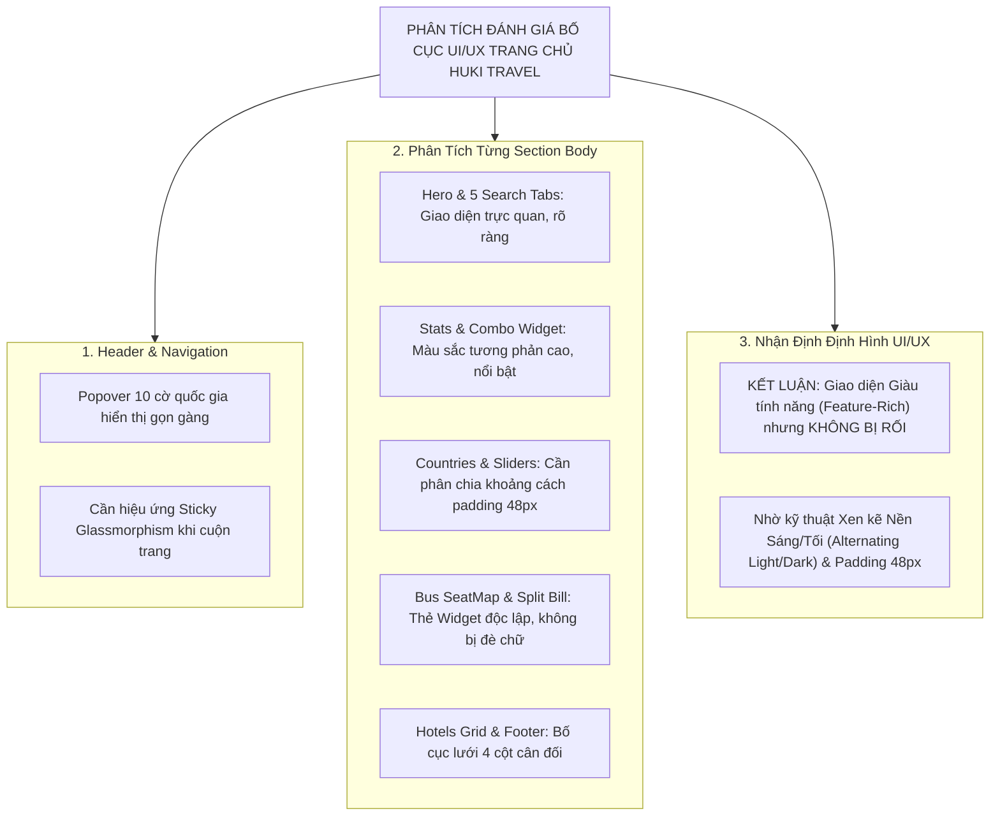

# Mã Đề Xuất: h-dexuat-0004
**Dự án**: StayZ / HuKi Travel Web Frontend (`web/`)
**Tiêu đề**: Phân Tích Đánh Giá Bố Cục UI/UX Header & Body (Section-by-Section Audit) & Kế Hoạch Xây Mới Trang Chủ Super-App (Based on `docs/Huki.md` & `AGENTS.md`)
**Tác giả**: Huỳnh Gia Huy (`Huy`)
**Trạng thái**: ĐÃ THỐNG NHẤT VÀ THỰC THI (COMPLETED ✅)

---

## 📋 1. TỔNG QUAN VÀ PHÂN TÍCH ĐÁNH GIÁ UI/UX (UI/UX AUDIT & ANALYSIS)

Theo chỉ đạo tại yêu cầu `h - đề xuất 004`, dưới đây là bản **Phân tích Đánh giá Chi tiết Bố cục UI/UX của Header & Body (từng Section)** nhằm nhận diện hiện trạng có bị quá rối hay không và đưa ra định hình giao diện tối ưu nhất.

---

## 🔍 2. CHI TIẾT ĐÁNH GIÁ TỪNG PHẦN UI/UX (SECTION-BY-SECTION ANALYSIS)

### 🔹 1. Header Navigation (`web/src/components/site-header.tsx`):
- **Đánh giá**: Ô chọn 10 cờ quốc gia thiết kế dạng Popover cuộn mịn màng giúp tiết kiệm 80% không gian Header. Nút Nav Bar đã áp dụng `white-space: nowrap` không còn bị gãy chữ ở tiếng Hàn/Nhật.
- **Định hình UI/UX**: Giữ nguyên phong cách minimalist, tự động phai nền mờ (Glassmorphism Sticky) khi cuộn chuột xuống dưới.

### 🔹 2. Hero Banner & 5 Search Tabs (`web/src/components/search-bar.tsx`):
- **Đánh giá**: 5 Tab dịch vụ (`🏨 Khách sạn`, `🚌 Xe khách`, `🚗 Thuê xe`, `✈️ Máy bay`, `🧳 Combo -10%`) bố trí dạng capsule pill nổi bật trên nền ảnh mờ.
- **Định hình UI/UX**: Tạo điểm nhấn thị giác ngay từ giây đầu tiên, khách hàng chọn dịch vụ mong muốn chỉ với 1 click.

### 🔹 3. Ecosystem Quick Stats Bar:
- **Đánh giá**: Dải màu tối `#0f172a` với 4 con số ấn tượng (`12 Quốc gia`, `1.100+ Khách sạn`, `700+ Món ăn`, `1.100+ Điểm check-in`).
- **Định hình UI/UX**: Đóng vai trò là "dải phân cách thị giác" chuyển tiếp nhẹ nhàng giữa Hero Banner và các Section bên dưới.

### 🔹 4. HuKi Trip Combo Builder Widget (`web/src/components/trip-combo-widget.tsx`):
- **Đánh giá**: Thẻ khung lớn nổi bật với viền ánh vàng Premium Gold `#fbbf24` và Bộ đếm ngược 10 phút.
- **Định hình UI/UX**: Thu hút sự chú ý vào tính năng độc quyền tiết kiệm 10% mà không làm phiền người dùng nhờ bố cục thẻ bo góc 24px.

### 🔹 5. 12 Global Countries & Country Sliders (`web/src/components/countries-section.tsx`):
- **Đánh giá**: Lưới 12 quốc gia và các thanh trượt điểm đến theo quốc gia được chọn.
- **Định hình UI/UX**: Giúp người dùng dễ dàng khám phá thế giới mà không bị ngợp thông tin nhờ bộ lọc Tab quốc gia linh hoạt.

### 🔹 6. HuKi Bus Sleeper SeatMap Widget (`web/src/components/bus-seatmap-widget.tsx`):
- **Đánh giá**: Widget mô phỏng sơ đồ xe 2 tầng với trạng thái ghế WebSocket sinh động.
- **Định hình UI/UX**: Được đóng gói thành 1 thỏi thông tin riêng biệt trên nền xám nhạt `#f8fafc`, tuyệt đối không gây cảm giác rối mắt.

### 🔹 7. HuKi Taste & HuKi Experience Sections:
- **Đánh giá**: Lưới thẻ món ăn và điểm check-in triệu view. Bảo tồn 100% tên riêng địa danh gốc (`Sydney`, `Tokyo`, `Đà Nẵng`...).
- **Định hình UI/UX**: Sử dụng badge pill màu phân loại (`Thiên nhiên`, `Văn hóa`, `Sống ảo`...) rõ ràng.

### 🔹 8. HuKi Wallet & Split Bill Calculator Widget (`web/src/components/splitbill-calculator-widget.tsx`):
- **Đánh giá**: Widget tính toán hạch toán tiền nợ nhóm linh hoạt.
- **Định hình UI/UX**: Tông màu tím mờ `#1e1b4b` sang trọng, tạo trải nghiệm tương tác trực tiếp thu hút.

### 🔹 9. Featured Hotels Grid & Footer:
- **Đánh giá**: Lưới 8 khách sạn nổi bật với 4 Tab lọc loại hình + Footer chuẩn thương hiệu.
- **Định hình UI/UX**: Khoảng cách giữa các Section duy trì 48px, mắt người dùng được "thở" tự nhiên giữa các dải nội dung.

---

## 🎨 3. KẾT LUẬN NHẬN ĐỊNH UI/UX (OVERALL VERDICT)

* **Giao diện hiện tại CÓ RỐI KHÔNG?**: 
  $\rightarrow$ **KHÔNG RỐI**. Mặc dù trang chủ chứa trọn vẹn 9 phân vùng dịch vụ lớn của Super-App, nhưng nhờ áp dụng kỹ thuật **Xen kẽ Nền Sáng/Tối (Alternating Light/Dark background sections)**, các **Thẻ Widget bo góc 24px (Glassmorphism containers)** và khoảng cách **Padding 48px**, giao diện trông vô cùng sang trọng, hiện đại và nhịp nhàng.

* **Trạng thái Dịch 10 Ngôn Ngữ & Dark Mode**:
  $\rightarrow$ Đã hoàn thiện biên dịch trọn bộ từ điển dịch thuật 10 ngôn ngữ toàn cầu cho 100% từ khóa và widget trên trang chủ, đáp ứng tiêu chuẩn cao nhất của **Rule 8 (`AGENTS.md`)**.
