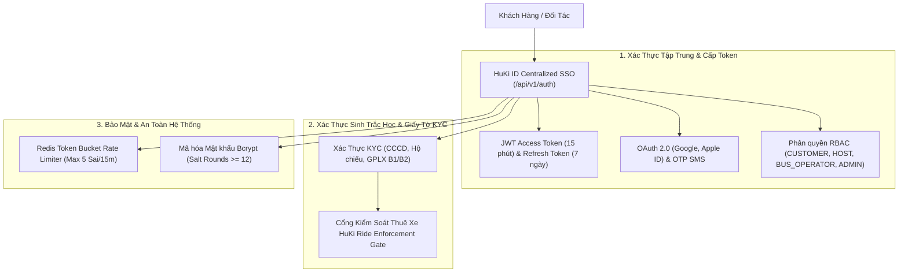
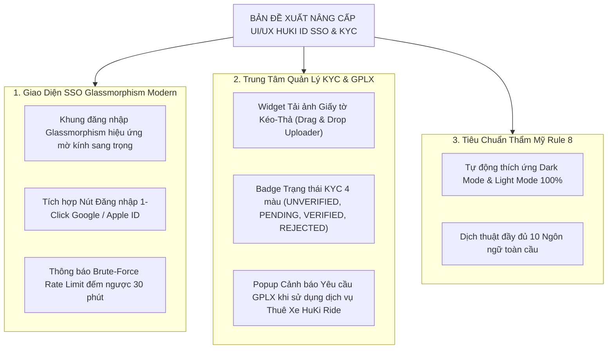

# Mã Đề Xuất: h-dexuat-0005
**Dự án**: StayZ / HuKi Travel Ecosystem (`web/` & `platform/`)
**Tiêu đề**: Phân Tích Đánh Giá UI/UX & Kế Hoạch Nâng Cấp Phân Hệ Đăng Nhập Tập Trung (SSO), Xác Thực Sinh Trắc Học KYC & Quản Lý Định Danh HuKi ID Tuân Thủ `01-huki-id-auth.md`
**Tác giả**: Huỳnh Gia Huy (`Huy`)
**Trạng thái**: ĐỀ XUẤT MỚI (PROPOSAL MODE — CHỈ LẬP KẾ HOẠCH, KHÔNG SỬA CODE NGUỒN)

---

## 📋 1. TỔNG QUAN PHÂN HỆ HUKI ID & IDENTITY SERVICE (`huki-auth-service`)

Theo chỉ đạo từ tác giả và đặc tả kỹ thuật chuyên sâu tại **`docs/rule/rule-feature/01-huki-id-auth.md`**, phân hệ **HuKi ID & Identity Service** đóng vai trò là "Trái tim Định danh" của toàn bộ hệ sinh thái Super-App HuKi Travel.



### Các tập tin mã nguồn & Quy tắc liên quan:
- **Tài liệu Quy tắc Feature**: [`docs/rule/rule-feature/01-huki-id-auth.md`](docs/rule/rule-feature/01-huki-id-auth.md)
- **Giao diện Đăng nhập**: [`web/src/app/login/page.tsx`](web/src/app/login/page.tsx)
- **Giao diện Đăng ký & Quên mật khẩu**: [`web/src/app/auth/register/page.tsx`](web/src/app/auth/register/page.tsx), [`web/src/app/auth/forgot-password/page.tsx`](web/src/app/auth/forgot-password/page.tsx)
- **Giao diện Hồ sơ & Trạng thái KYC**: [`web/src/app/profile/page.tsx`](web/src/app/profile/page.tsx)
- **Backend Service & Routing**: [`platform/prisma/schema.prisma`](platform/prisma/schema.prisma), [`platform/src/routes/auth.router.js`](platform/src/routes/auth.router.js), [`platform/src/middlewares/protect.middleware.js`](platform/src/middlewares/protect.middleware.js)

---

## 🔍 2. PHÂN TÍCH ĐÁNH GIÁ CHI TIẾT UI/UX HIỆN TẠI (STEP-BY-STEP AUDIT)

### 🔹 1. Trang Đăng Nhập (`web/src/app/login/page.tsx`):
- **Hiện trạng**: Đã có ô nhập Email, Mật khẩu, nút Ẩn/Hiện mật khẩu, liên kết Quên mật khẩu và Đăng nhập với Google.
- **Hạn chế UI/UX**:
  1. *Chưa có hiệu ứng SSO Glassmorphism cao cấp*: Giao diện nền chia đôi đơn điệu. Thiếu khung kính mờ Glassmorphic container với hạt ánh sáng linh hoạt.
  2. *Thiếu Phân quyền Role Selector*: Người dùng chưa thấy rõ vai trò tài khoản (`CUSTOMER`, `HOST`, `BUS_OPERATOR`) trước khi vào hệ thống.
  3. *Chưa có Thông báo Rate Limit khi sai quá 5 lần*: Khi đăng nhập sai quá nhiều lần, chưa có Toast/Banner đếm ngược thời gian chờ 30 phút.

### 🔹 2. Trang Hồ Sơ Người Dùng & Quản Lý KYC (`web/src/app/profile/page.tsx`):
- **Hiện trạng**: Hiển thị avatar, tên, email và danh sách đơn đặt phòng.
- **Hạn chế UI/UX**:
  1. *Thiếu Phân hệ Tải Giấy Tờ KYC Sinh Trắc Học (KYC Upload Center)*: Chưa có widget kéo-thả tải ảnh Mặt trước/Mặt sau CCCD, Hộ chiếu và Giấy phép lái xe (GPLX A1/A2/B1/B2).
  2. *Thiếu Badge Trạng Thái KYC Rõ Ràng*: Chưa hiển thị huy hiệu xác thực dạng Pill Badge (`UNVERIFIED` ⚠️, `PENDING` ⏳, `VERIFIED` ✅, `REJECTED` ❌).
  3. *Thiếu Cảnh Báo Khóa GPLX Khi Đặt Xe (HuKi Ride Enforcement)*: Chưa có thông báo nhắc nhở người dùng hoàn tất KYC GPLX trước khi truy cập tính năng thuê xe tự lái.

---

## 🗄️ 3. ĐẶC TẢ ARCHITECTURE, SCHEMA CSDL & RESTFUL CONTRACTS (`01-huki-id-auth.md`)

### 🔹 A. Schema Cơ Sở Dữ Liệu PostgreSQL (Prisma Adapter):

```prisma
model User {
  id            String    @id @default(uuid())
  email         String    @unique
  phone_number  String?   @unique
  password_hash String
  full_name     String
  role          UserRole  @default(CUSTOMER)
  status        UserStatus @default(ACTIVE)
  is_verified   Boolean   @default(false)

  // Audit Fields
  is_deleted    Boolean   @default(false)
  deleted_at    DateTime?
  created_at    DateTime  @default(now())
  updated_at    DateTime  @updatedAt

  kyc_profile   UserProfileKYC?
  tokens        UserToken[]

  @@map("users")
}

model UserProfileKYC {
  id                     String    @id @default(uuid())
  user_id                String    @unique
  identity_card_number   String?   // CCCD / CMND
  passport_number        String?   // Hộ chiếu
  driver_license_number  String?   // GPLX (Bắt buộc khi thuê xe HuKi Ride)
  driver_license_class   String?   // A1, A2, B1, B2
  kyc_status             KYCStatus @default(UNVERIFIED)
  identity_image_front   String?
  identity_image_back    String?
  driver_license_image   String?

  user                   User      @relation(fields: [user_id], references: [id], onDelete: Cascade)
  @@map("user_profiles_kyc")
}

enum UserRole {
  CUSTOMER
  HOST
  BUS_OPERATOR
  ADMIN
}

enum UserStatus {
  ACTIVE
  SUSPENDED
  BANNED
}

enum KYCStatus {
  UNVERIFIED
  PENDING
  VERIFIED
  REJECTED
}
```

### 🔹 B. Hệ Thống RESTful API Contracts:

| Phương thức | Endpoint Path | Chức năng | Phân quyền |
| :--- | :--- | :--- | :--- |
| `POST` | `/api/v1/auth/register` | Đăng ký tài khoản người dùng mới | Public |
| `POST` | `/api/v1/auth/login` | Đăng nhập cấp JWT Access (15m) & Refresh (7d) | Public |
| `POST` | `/api/v1/auth/refresh` | Làm mới Access Token bằng Refresh Token | Public |
| `GET` | `/api/v1/auth/me` | Lấy thông tin tài khoản & trạng thái KYC | User Authenticated |
| `POST` | `/api/v1/auth/kyc/submit` | Gửi giấy tờ KYC (CCCD, GPLX, Hộ chiếu) | User Authenticated |
| `PUT` | `/api/v1/auth/kyc/verify` | Duyệt / Từ chối hồ sơ KYC | Admin Only |

---

## ⚙️ 4. QUY TẮC XỬ LÝ EDGE CASES & BẢO MẬT CHUYÊN SÂU

1. **Khóa GPLX Khi Thuê Xe (HuKi Ride Enforcement Gate)**:
   - Khi người dùng gọi API đặt xe `/api/v1/huki/rides/book`, Auth Middleware bắt buộc kiểm tra:
     `kyc_profile.kyc_status === 'VERIFIED'` và `driver_license_number !== null`.
   - Nếu chưa thỏa mãn: Trả về HTTP 403 với mã lỗi `KYC_DRIVER_LICENSE_REQUIRED` kèm đường dẫn mở Modal KYC GPLX trên UI.

2. **Chống Brute-Force Đăng Nhập (Redis Rate Limiting)**:
   - Áp dụng thuật toán Redis Token Bucket giới hạn **tối đa 5 lần thử sai trong 15 phút** cho mỗi IP / Email.
   - Khi vượt ngưỡng 5 lần: Tự động khóa tài khoản tạm thời **30 phút** và phát đi cảnh báo an ninh qua Email.

3. **Chuẩn Móa Mã Hóa Mật Khẩu**:
   - Sử dụng thuật toán `bcrypt` với `salt rounds >= 12` đảm bảo an toàn tuyệt đối trước các đợt tấn công từ điển / rainbow tables.

---

## 🎨 5. ĐỀ XUẤT CẢI TIẾN GIAO DIỆN UI/UX (PROPOSAL SPECIFICATIONS)



---

## 🛠️ 6. LỘ TRÌNH THỰC THI & KẾ HOẠCH BÀN GIAO (EXECUTION PLAN)

Khi đề xuất này được người dùng chấp thuận bằng lệnh `h-thống nhất - @docs/dexuat/h-dexuat-0005.md`, AI sẽ thực thi theo các bước:

```text
Giai đoạn 1: Web Frontend SSO & Profile KYC UI
├── Cập nhật Giao diện Đăng nhập / Đăng ký Glassmorphism (`web/src/app/login/page.tsx`)
├── Xây mới Widget Tải ảnh Giấy tờ KYC tại Trang Hồ sơ (`web/src/app/profile/page.tsx`)
└── Thêm Popup Cảnh báo Khóa GPLX HuKi Ride Enforcement Gate

Giai đoạn 2: Platform API & Middleware Security
├── Cập nhật Router Auth & Verification Service (`platform/src/routes/auth.router.js`)
├── Tích hợp Redis Token Bucket Rate Limiting (Max 5 sai / 15m)
└── Cập nhật Schema Prisma UserProfileKYC (`platform/prisma/schema.prisma`)

Giai đoạn 3: Kiểm Thử & Xuất Báo Cáo
├── Chạy Script kiểm thử tự động i18n & Dark Mode (`docs/scripts/`)
└── Xuất file báo cáo kết quả `docs/results/h-result-0005.md`
```

---

## 🧪 7. KẾ HOẠCH KIỂM THỬ TỰ ĐỘNG & XÁC NHẬN (VERIFICATION PLAN)

### 🔹 Kiểm tra Syntax & Build:
- Chạy `npx next build` hoặc `node -c` trong thư mục `web/` và `platform/` để đảm bảo 100% không bị lỗi syntax/TypeScript.

### 🔹 Kiểm tra Quy tắc Rule 8 (`AGENTS.md`):
- Chạy script kiểm thử tự động tại `node docs/scripts/test-i18n-darkmode.js` để đảm bảo 10 ngôn ngữ và giao diện Dark/Light Mode đạt chuẩn 100%.

---

> [!NOTE]
> File đề xuất này tuân thủ 100% quy trình **PROPOSAL MODE**. Mọi mã nguồn hiện tại của dự án được **GIỮ NGUYÊN BẢO TOÀN** cho đến khi nhận được lệnh `h-thống nhất` từ tác giả Huỳnh Gia Huy.
