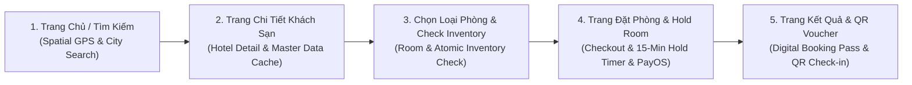
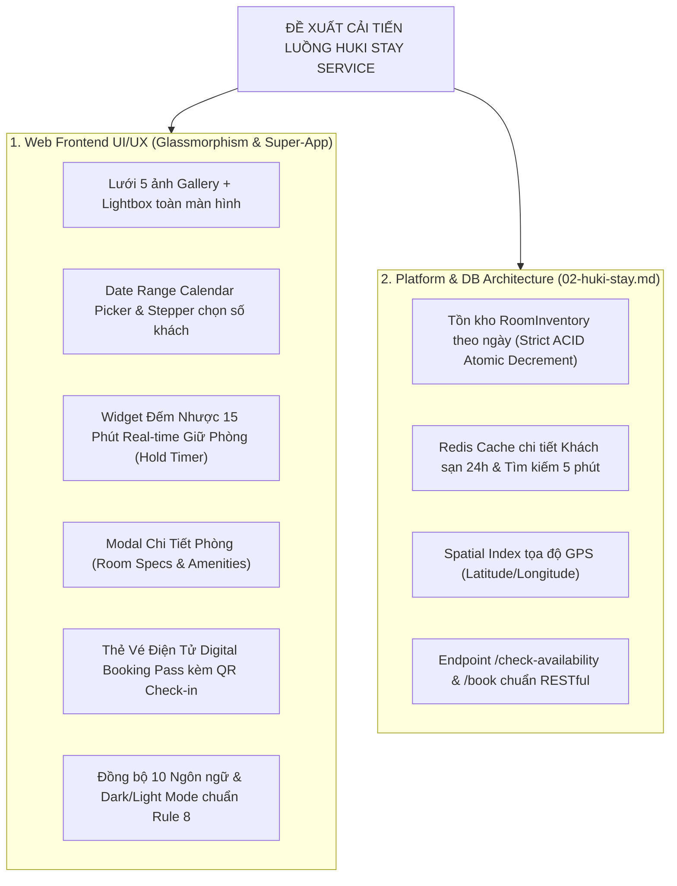

# Mã Đề Xuất: h-dexuat-0006
**Dự án**: StayZ / HuKi Travel Ecosystem (`web/` & `platform/`)
**Tiêu đề**: Phân Tích Đánh Giá Bố Cục UI/UX Hiện Tại & Đề Xuất Nâng Cấp Toàn Diện Luồng Đặt Phòng Khách Sạn Tuân Thủ Quy Tắc `02-huki-stay.md`
**Tác giả**: Huỳnh Gia Huy (`Huy`)
**Trạng thái**: ĐỀ XUẤT MỚI (PROPOSAL MODE — CHỈ LẬP KẾ HOẠCH, KHÔNG SỬA CODE NGUỒN)

---

## 📋 1. TỔNG QUAN LUỒNG ĐẶT PHÒNG KHÁCH SẠN HIỆN TẠI (CURRENT HOTEL BOOKING FLOW)

Theo chỉ đạo từ tác giả và đặc tả kỹ thuật chuyên sâu tại **`docs/rule/rule-feature/02-huki-stay.md`** (`huki-stay-service`), chúng ta ưu tiên **giải quyết triệt để vấn đề UI/UX hiển thị** và chuẩn hóa kiến trúc cho luồng **Đặt Phòng Khách Sạn (Hotel Booking Flow)** trước khi bắt đầu chỉnh sửa luồng chạy toàn bộ hệ thống.

Luồng đặt phòng hiện tại trải qua 5 bước chính:



### Các tập tin mã nguồn & Quy tắc liên quan:
- **Tài liệu Quy tắc Feature**: [`docs/rule/rule-feature/02-huki-stay.md`](docs/rule/rule-feature/02-huki-stay.md)
- **Trang danh sách & Tìm kiếm**: [`web/src/app/search/page.tsx`](web/src/app/search/page.tsx), [`web/src/app/properties/page.tsx`](web/src/app/properties/page.tsx)
- **Trang chi tiết khách sạn**: [`web/src/app/hotels/[city]/[slug]/page.tsx`](web/src/app/hotels/[city]/[slug]/page.tsx)
- **Trang đặt phòng & Checkout**: [`web/src/app/hotels/[city]/[slug]/book/page.tsx`](web/src/app/hotels/[city]/[slug]/book/page.tsx)
- **Component thẻ phòng & Đánh giá**: [`web/src/components/hotel/RoomCard.tsx`](web/src/components/hotel/RoomCard.tsx), [`web/src/components/hotel/ReviewCard.tsx`](web/src/components/hotel/ReviewCard.tsx)
- **Backend Service & Prisma Model**: [`platform/prisma/schema.prisma`](platform/prisma/schema.prisma), [`platform/src/routes/booking.router.js`](platform/src/routes/booking.router.js), [`platform/src/services/booking.service.js`](platform/src/services/booking.service.js)

---

## 🔍 2. PHÂN TÍCH ĐÁNH GIÁ CHI TIẾT UI/UX TỪNG MÀN HÌNH (STEP-BY-STEP AUDIT)

### 🔹 Bước 1: Trang Danh Sách Khách Sạn & Bộ Lọc (`web/src/app/properties/page.tsx`)
- **Đối chiếu với `02-huki-stay.md`**:
  - *Hiện trạng*: Đã có danh sách hiển thị tên, ảnh, thành phố và giá.
  - *Hạn chế*: Thiếu bộ lọc theo bán kính GPS (Spatial Index), lọc mức giá `price_from`, lọc hạng sao `star_rating`, và tiện ích `amenities` (Hồ bơi, Wifi, Đưa đón sân bay, Giặt ủi...).
  - *Đánh giá UI/UX*: Thiếu thanh lọc Sidebar cố định (Sticky Filters) và nút chuyển đổi xem Bản đồ vị trí trực quan (Map View Toggle).

### 🔹 Bước 2: Trang Chi Tiết Khách Sạn (`web/src/app/hotels/[city]/[slug]/page.tsx`)
- **Đối chiếu với `02-huki-stay.md`**:
  - *Hiện trạng*: Đã có thông tin khách sạn master data.
  - *Hạn chế*:
    1. *Gallery ảnh*: Hiện tại chỉ có 2 khung ảnh (1 lớn + 1 nhỏ). Cần thiết kế lưới 5 ảnh chuẩn Super-App kèm nút "Xem tất cả Album" (Full-screen Lightbox Gallery).
    2. *Sticky Booking Sidebar*: Khung bên phải chỉ có giá từ và nút cuộn `#rooms`. Cần cho phép người dùng chọn Ngày Check-in / Check-out và Số lượng khách ngay tại đây để gọi API `/api/v1/properties/check-availability` tính tồn kho & báo giá dự toán ngay lập tức.
    3. *Thông tin tọa độ GPS (Latitude, Longitude)*: Chưa hiển thị bản đồ mini định vị tọa độ kèm khoảng cách đến trung tâm thành phố và sân bay.

### 🔹 Bước 3: Danh Sách Loại Phòng (`#rooms` section & `RoomCard.tsx`)
- **Đối chiếu với `02-huki-stay.md`**:
  - *Hiện trạng*: Hiển thị danh sách phòng cơ bản.
  - *Hạn chế*: Thẻ phòng chưa có nút bật Modal "Chi tiết phòng & Tồn kho theo ngày", chưa hiển thị badge số lượng phòng còn trống theo ngày chọn.

### 🔹 Bước 4: Trang Đặt Phòng & Checkout (`web/src/app/hotels/[city]/[slug]/book/page.tsx`)
- **Đối chiếu với `02-huki-stay.md`**:
  - *Hiện trạng*: Đã hỗ trợ 2 Kế hoạch Thanh toán: **Trả trước 100%** hoặc **Đặt cọc 30%** (Trả phần còn lại tại khách sạn). Tích hợp cổng PayOS.
  - *Hạn chế*:
    1. *Thiếu Bộ chọn Ngày dải khoảng (Date Range Picker UI)*: Đang dùng `<input type="date">` đơn điệu. Cần thay bằng Calendar Popup hiện đại tính số đêm `N đêm` mượt mà.
    2. *Thiếu Đồng Hồ Đếm Nhược Giữ Phòng Real-time 15 Phút*: Backend đã có logic khóa giữ phòng `payment_expires_at` (15 phút), nhưng trên UI Checkout **KHÔNG hiển thị đồng hồ đếm ngược sinh động** (`⏳ Phòng của bạn đang được giữ trong 14:59 phút`). Cần bổ sung để tạo tính cấp thiết và minh bạch cho người dùng.
    3. *Thiếu Form Thông tin Khách hàng & Yêu cầu Đặc biệt*: Cần ô điền Họ tên, Số điện thoại, Email nhận vé và ghi chú (Check-in sớm, Phòng tầng cao...).
    4. *Thiếu Ô Nhập Mã Giảm Giá (Coupon)*: Chưa có ô nhập Voucher chiết khấu giá.

### 🔹 Bước 5: Trang Xác Nhận & Vé Điện Tử QR Code (`web/src/app/payment/return/page.tsx`)
- **Đối chiếu với `02-huki-stay.md`**:
  - *Hạn chế*: Chưa có Thẻ Vé Đặt Phòng Điện Tử (Digital Booking Pass) tích hợp QR Code Check-in (`check_in_code`) cho Lễ tân quét mã tại quầy.

---

## 🎨 3. ĐỀ XUẤT NÂNG CẤP GIAO DIỆN UI/UX & ĐẶC TẢ TÍNH NĂNG CHUẨN `02-huki-stay.md`



### 🎯 Các điểm nâng cấp trọng tâm:

1. **Bộ Đếm Nhược Real-Time Giữ Phòng 15 Phút (15-Min Live Hold Timer)**:
   - Hiển thị Banner Glassmorphic nổi bật ở đầu trang Checkout: `⏳ Phòng của bạn đang được tạm giữ trong [14:59] phút. Hoàn tất thanh toán PayOS để đảm bảo giữ chỗ.`
   - Khi đếm về 0: Cảnh báo quá thời gian giữ chỗ và gợi ý tải lại để kiểm tra lại tồn kho.

2. **Bộ Chọn Ngày & Khách Đẳng Cấp (Interactive Date-Range Calendar)**:
   - Bộ chọn ngày dải khoảng hiện đại (Check-in / Check-out), tự động tính số đêm (`N đêm`).
   - Bộ chọn số khách & số phòng dạng Stepper (+ / -) trực quan.

3. **Kế Hoạch Thanh Toán Đặt Cọc 30% & 100% (Payment Plan Selector)**:
   - Thẻ `Plan Card` tương tác cao cấp:
     - 💳 **Thanh toán 100%**: Thanh toán toàn bộ, nhận vé ngay.
     - 🪙 **Đặt cọc 30%**: Trả trước `X ₫`, số tiền còn lại `Y ₫` thanh toán khi nhận phòng tại khách sạn.

4. **Thẻ Vé Điện Tử Digital Booking Pass & QR Code Check-in**:
   - Giao diện Boarding Pass sang trọng sau khi thanh toán thành công với Mã QR Check-in `check_in_code` phục vụ quét mã nhận phòng nhanh.

5. **Đồng bộ Quy Tắc Rule 8 (`AGENTS.md`)**:
   - **Dark Mode & Light Mode**: Đầy đủ 2 chế độ sáng/tối.
   - **Dịch thuật 10 Ngôn ngữ**: Đầy đủ 10 ngôn ngữ (`vi`, `en`, `ko`, `ja`, `th`, `zh`, `fr`, `de`, `es`, `ru`).
   - **Bảo tồn Tên địa danh**: Giữ nguyên tên gốc địa danh (`Đà Nẵng`, `Tokyo`, `Sydney`...).

---

## 🛠️ 4. LỘ TRÌNH THỰC THI & KẾ HOẠCH BÀN GIAO (EXECUTION PLAN)

Sau khi thống nhất bằng lệnh `h-thống nhất - @docs/dexuat/h-dexuat-0006.md`, AI sẽ tiến hành thực thi theo các giai đoạn:

```text
Giai đoạn 1: Web Frontend UI Components
├── Nâng cấp Header & Gallery 5 ảnh tại Hotel Detail (`web/src/app/hotels/[city]/[slug]/page.tsx`)
├── Xây mới Component Date Range Calendar & Stepper chọn khách
└── Nâng cấp RoomCard & Modal Chi tiết phòng (`web/src/components/hotel/`)

Giai đoạn 2: Checkout Page & Realtime 15-Min Hold Timer (`web/src/app/hotels/[city]/[slug]/book/page.tsx`)
├── Tích hợp Widget Đồng hồ đếm ngược 15 phút (Hold Timer)
├── Thêm Form Thông tin Khách hàng & Ô nhập Coupon Giảm giá
└── Hoàn thiện Thẻ chọn Kế hoạch thanh toán (Deposit 30% vs Full 100%)

Giai đoạn 3: Return Page & Digital QR Pass (`web/src/app/payment/return/page.tsx`)
└── Xây mới Thẻ Vé Điện Tử Digital Booking Pass & QR Code Check-in

Giai đoạn 4: Kiểm Thử & Báo Cáo Result
├── Chạy Script kiểm thử tự động i18n & Dark Mode (`docs/scripts/`)
└── Xuất file báo cáo kết quả `docs/results/h-result-0006.md`
```

---

## 🧪 5. KẾ HOẠCH KIỂM THỬ TỰ ĐỘNG & XÁC NHẬN (VERIFICATION PLAN)

### 🔹 Kiểm tra Syntax & Build:
- Chạy `npx next build` hoặc `node -c` trong thư mục `web/` để đảm bảo 100% không bị lỗi syntax/TypeScript.

### 🔹 Kiểm tra Quy tắc Rule 8 (`AGENTS.md`):
- Chạy script kiểm thử tự động tại `node docs/scripts/test-i18n-darkmode.js` để đảm bảo 10 ngôn ngữ và giao diện Dark/Light Mode đạt chuẩn 100%.

---

> [!NOTE]
> File đề xuất này tuân thủ 100% quy trình **PROPOSAL MODE**. Mọi mã nguồn hiện tại của dự án được **GIỮ NGUYÊN BẢO TOÀN** cho đến khi nhận được lệnh `h-thống nhất` từ tác giả Huỳnh Gia Huy.
