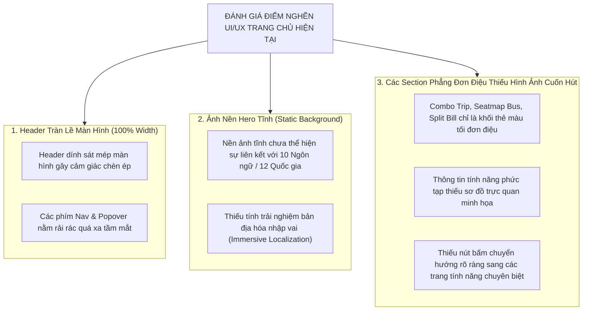
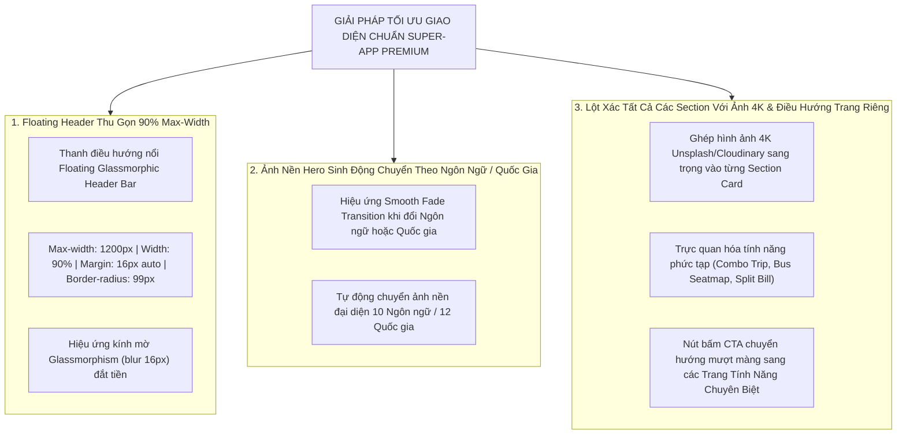
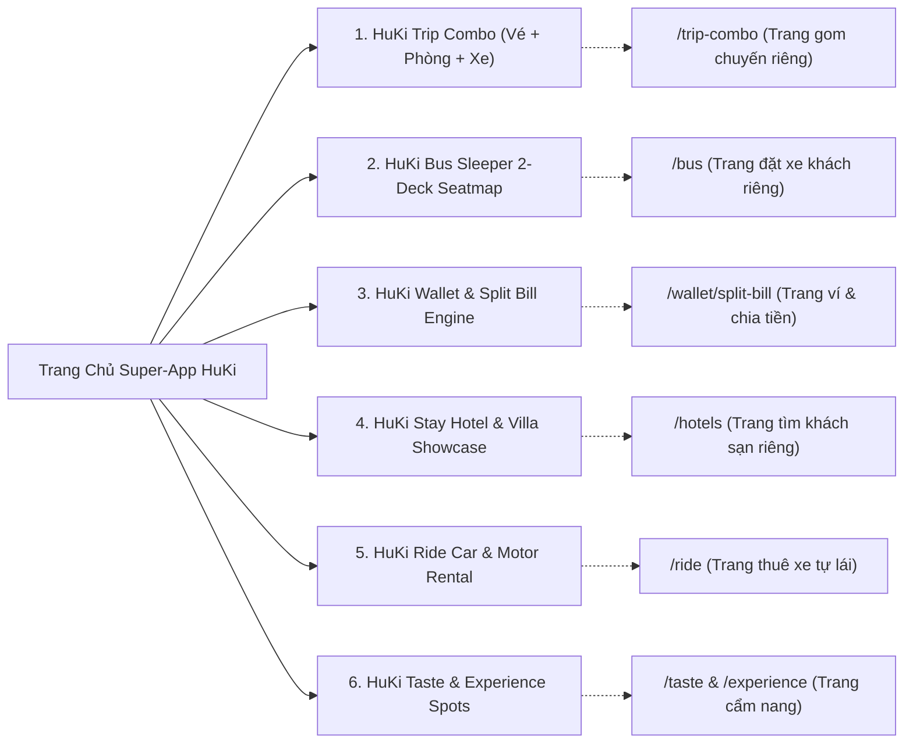

# Mã Đề Xuất: h-dexuat-0007
**Dự án**: StayZ / HuKi Travel Web Frontend (`web/`)
**Tiêu đề**: Phân Tích Đánh Giá & Kế Hoạch Tối Ưu UI/UX Trang Chủ Super-App: Thu Gọn Floating Header (90% Max-Width), Ảnh Nền Hero Sinh Động Chuyển Theo Ngôn Ngữ / Quốc Gia, Tải Ảnh 4K Cuốn Hút Cho Toàn Bộ Các Section & Điều Hướng Trang Riêng
**Tác giả**: Huỳnh Gia Huy (`Huy`)
**Trạng thái**: ĐỀ XUẤT MỚI (PROPOSAL MODE — CHỈ LẬP KẾ HOẠCH, KHÔNG SỬA CODE NGUỒN)

---

## 📋 1. TỔNG QUAN VÀ NHẬN ĐỊNH HIỆN TRẠNG UI/UX (OVERVIEW & AUDIT)

Theo đánh giá trực quan từ tác giả Huỳnh Gia Huy dựa trên ảnh chụp thực tế của hệ thống, giao diện Trang Chủ hiện tại đang gặp một số **điểm nghẽn về mặt thị giác (Visual Bottlenecks)** khiến tổng thể trông bị **quá rối, phẳng đơn điệu và chèn ép**:



---

## 🎨 2. ĐỀ XUẤT CẢI TIẾN VÀ ĐỊNH HÌNH THẨM MỸ CAO CẤP (PROPOSAL SPECIFICATIONS)

Dựa trên tiêu chuẩn thiết kế Super-App của dự án tại **`AGENTS.md` (Rule 8 & Rule 9)** và định hướng đặc tả ảnh **`docs/db/promt.img.md`**, dưới đây là kế hoạch tái thiết kế chi tiết:



---

## 🛠️ 3. CHI TIẾT TỪNG PHẦN ĐIỀU CHỈNH GIAO DIỆN (DETAILED BREAKDOWN)

### 🔹 1. Floating Header Thu Gọn 90% Max-Width ([`web/src/components/site-header.tsx`](web/src/components/site-header.tsx))
- **Thiết kế**: Thu gọn khung Header dính tràn lề thành **Thanh Floating Header dạng Capsule nổi**:
  - `max-width: 1200px; width: 90%; margin: 16px auto 0 auto; border-radius: 99px;`
  - Nền mờ kính Glassmorphism sang trọng: `backdrop-filter: blur(16px); background: rgba(15, 23, 42, 0.75); border: 1px solid rgba(255, 255, 255, 0.18);`
  - Rút ngắn khoảng cách giữa các phím menu giúp người dùng thao tác dễ dàng trên mọi độ phân giải.

### 🔹 2. Ảnh Nền Hero Sinh Động Chuyển Theo Ngôn Ngữ / Quốc Gia ([`web/src/components/home-interactive.tsx`](web/src/components/home-interactive.tsx))
- **Cơ chế**: Khi người dùng chuyển đổi Ngôn ngữ (`lang`) hoặc chọn Quốc gia (`country`), ảnh nền Hero (`hero-bg`) tự động chuyển đổi mịn màng với hiệu ứng **Smooth Fade Transition (0.5s)**:
  - 🇻🇳 **Tiếng Việt (`vi`) / Việt Nam (`vn`)**: Vịnh Hạ Long & Cầu Vàng Đà Nẵng.
  - 🇬🇧 **Tiếng Anh (`en`) / Mỹ (`us`) / Úc (`au`)**: Nhà hát Opera Sydney & Quảng trường Thời Đại NY.
  - 🇰🇷 **Tiếng Hàn (`ko`) / Hàn Quốc (`kr`)**: Tháp N Seoul & Mùa thu Đảo Jeju.
  - 🇯🇵 **Tiếng Nhật (`ja`) / Nhật Bản (`jp`)**: Núi Phú Sĩ & Đêm hoa anh đào Kyoto.
  - 🇨🇳 **Tiếng Trung (`zh`) / Trung Quốc (`cn`)**: Vạn Lý Trường Thành & Đêm Bến Thượng Hải.
  - 🇹🇭 **Tiếng Thái (`th`) / Thái Lan (`th`)**: Chùa Vàng Wat Arun Bangkok & Đảo Phuket.
  - 🇫🇷 **Tiếng Pháp (`fr`)**: Tháp Eiffel Paris lung linh về đêm.
  - 🇩🇪 **Tiếng Đức (`de`) / Thụy Sĩ (`ch`)**: Lâu đài Neuschwanstein & Dãy Alps Thụy Sĩ.
  - 🇪🇸 **Tiếng Tây Ban Nha (`es`)**: Kiến trúc độc đáo Barcelona.
  - 🇷🇺 **Tiếng Nga (`ru`)**: Quảng trường Đỏ & Điện Kremlin Moscow.

### 🔹 3. Tối Ưu Thanh Tìm Kiếm Hero Search Bar ([`web/src/components/search-bar.tsx`](web/src/components/search-bar.tsx))
- **Thiết kế**: Thay thế khối xám đục hiện tại bằng **Thanh Capsules Đa Năng viền Glassmorphism**:
  - Bổ sung **Icon trực quan**: 📍 *Địa điểm / Thành phố*, 📅 *Ngày nhận/trả*, 👥 *Số khách & phòng*.
  - Tách rời các phân vùng rõ ràng bằng dải phân cách mờ 1px.
  - Nút "Tìm kiếm ngay" thiết kế dạng bo góc pill sang trọng, hiệu ứng Hover Glow khi di chuột.

---

## 🖼️ 4. TÁI THIẾT KẾ TOÀN BỘ CÁC SECTION TRANG CHỦ: HÌNH ẢNH 4K & ĐIỀU HƯỚNG TRANG RIÊNG

Để loại bỏ sự đơn điệu và giải thích trực quan các tính năng cốt lõi cho người dùng, tất cả 6 Section chính trên Trang Chủ được nâng cấp hình ảnh 4K sang trọng cùng nút chuyển hướng trang riêng:



### 🖼️ Section 1: HuKi Trip Combo Bundle (`Gom Chuyến Đi Đa Dịch Vụ - Tiết Kiệm 10%`)
- **Tối ưu Thị giác & Hình ảnh**:
  - Tích hợp ảnh nền 4K du lịch đa phương tiện (Máy bay cất cánh + Khách sạn biển sang trọng).
  - Thẻ đếm ngược **Real-time 10-Minute Hold Timer** thiết kế dạng Neon Glow rực rỡ.
- **Trực quan hóa tính năng**:
  - Thẻ Infographic 3 bước đơn giản: *1. Chọn vé máy bay/xe khách $\rightarrow$ 2. Thêm phòng khách sạn $\rightarrow$ 3. Thêm xe tự lái (Nhận ngay ưu đãi 10%)*.
- **Điều hướng trang riêng**:
  - Nút CTA nổi bật: **"Khám Phá Gom Chuyến Đi Combo $\rightarrow$"** chuyển hướng thẳng sang `/trip-combo`.

### 🖼️ Section 2: HuKi Bus Real-Time Seatmap (`Sơ Đồ Ghế Giường Nằm 2 Tầng`)
- **Tối ưu Thị giác & Hình ảnh**:
  - Tích hợp ảnh 4K ngoại thất xe giường nằm 2 tầng VIP Limousine đắt giá cùng khoang giường nằm riêng biệt.
  - Sơ đồ ghế 2 tầng (Deck 1 / Deck 2) nâng cấp giao diện mô phỏng không gian thực tế với trạng thái WebSocket live (`Đã đặt`, `Đang chọn`, `Còn trống`).
- **Trực quan hóa tính năng**:
  - Giải thích trực quan cơ chế **Tự động khóa giữ chỗ 10 phút via Redis Redlock** giúp người dùng hoàn toàn yên tâm chọn vị trí đẹp nhất.
- **Điều hướng trang riêng**:
  - Nút CTA: **"Đặt Vé Xe Khách Giường Nằm $\rightarrow$"** chuyển hướng thẳng sang `/bus`.

### 🖼️ Section 3: HuKi Wallet & Split Bill Engine (`Quản Lý Chi Tiêu Nhóm & Hạch Toán Nợ Chéo`)
- **Tối ưu Thị giác & Hình ảnh**:
  - Tích hợp ảnh 4K giao diện Ví vé điện tử **HuKi Pass & Thẻ Dynamic VietQR Code**.
  - Bộ công cụ tính toán nhanh **Split Bill Calculator Demo** trực quan sống động trên Trang Chủ (Nhập tổng tiền $\rightarrow$ Chọn số người $\rightarrow$ Tự động hiển thị số tiền mỗi người cần thanh toán).
- **Trực quan hóa tính năng**:
  - Sơ đồ minh họa toán nợ chéo thông minh: Giảm từ 10 giao dịch chuyển tiền phức tạp giữa 5 người xuống chỉ còn 2 giao dịch tối giản.
- **Điều hướng trang riêng**:
  - Nút CTA: **"Mở Công Cụ Chia Tiền Nhóm $\rightarrow$"** chuyển hướng thẳng sang `/wallet/split-bill`.

### 🖼️ Section 4: HuKi Stay (`Khách Sạn, Villa & Resort Hạng Sang`)
- **Tối ưu Thị giác & Hình ảnh**:
  - Bộ sưu tập Card Khách sạn 4K chuẩn Unsplash/Cloudinary với nhãn giá minh bạch và huy hiệu Đặt Cọc 30%.
- **Điều hướng trang riêng**:
  - Nút CTA: **"Xem Tất Cả Khách Sạn & Villa $\rightarrow$"** chuyển hướng sang `/hotels`.

### 🖼️ Section 5: HuKi Ride (`Thuê Xe Máy & Ô Tô Tự Lái`)
- **Tối ưu Thị giác & Hình ảnh**:
  - Thẻ bài hiển thị xe ô tô SUV 45 độ bóng bẩy và xe máy tay ga đời mới kèm huy hiệu Xác Thực GPLX.
- **Điều hướng trang riêng**:
  - Nút CTA: **"Thuê Xe Tự Lái Tức Thì $\rightarrow$"** chuyển hướng sang `/ride`.

### 🖼️ Section 6: HuKi Taste & Experience (`Ẩm Thực Đặc Sản & Điểm Check-in Triệu View`)
- **Tối ưu Thị giác & Hình ảnh**:
  - Gallery ảnh Food Photography cận cảnh các món ăn đặc sản và danh lam thắng cảnh Việt Nam 4K rực rỡ.
- **Điều hướng trang riêng**:
  - Nút CTA: **"Khám Phá Cẩm Nang Du Lịch $\rightarrow$"** chuyển hướng sang `/experience`.

---

## 🛠️ 5. LỘ TRÌNH THỰC THI & BÀN GIAO (EXECUTION PLAN)

Sau khi thống nhất bằng lệnh `h-thống nhất - @docs/dexuat/h-dexuat-0007.md`, AI sẽ tiến hành thực thi theo 4 giai đoạn:

```text
Giai đoạn 1: Nâng Cấp Floating Header 90% Max-Width (`web/src/components/site-header.tsx`)
└── Áp dụng max-width: 90% / 1200px, border-radius: 99px & Glassmorphism blur

Giai đoạn 2: Tích Hợp Ảnh Nền Hero Sinh Động Chuyển Theo Ngôn Ngữ (`web/src/components/home-interactive.tsx`)
└── Tạo bộ sưu tập 10 ảnh chất lượng cao đại diện cho 10 quốc gia & hiệu ứng Fade transition

Giai đoạn 3: Lột Xác Toàn Bộ Các Section Với Ảnh 4K & Nút Chuyển Hướng Trang Riêng (`web/src/components/home-interactive.tsx`)
├── Tích hợp ảnh 4K Unsplash/Cloudinary cho Combo Trip, Bus Seatmap, Split Bill, Stay, Ride, Taste
└── Bổ sung thẻ minh họa tính năng & đường dẫn CTA sang các trang riêng (/trip-combo, /bus, /wallet/split-bill...)

Giai đoạn 4: Kiểm Thử & Xuất Báo Cáo Result
├── Chạy Script kiểm thử tự động i18n & Dark Mode (`docs/scripts/test-i18n-darkmode.js`)
└── Xuất file báo cáo kết quả `docs/results/h-result-0007.md`
```

---

## 🧪 6. KẾ HOẠCH KIỂM THỬ TỰ ĐỘNG & XÁC NHẬN (VERIFICATION PLAN)

### 🔹 Kiểm tra Syntax & Build:
- Chạy `npx next build` hoặc `node -c` trong thư mục `web/` để đảm bảo 100% không bị lỗi syntax/TypeScript.

### 🔹 Kiểm tra Quy tắc Rule 8 (`AGENTS.md`):
- Chạy script kiểm thử tự động tại `node docs/scripts/test-i18n-darkmode.js` để đảm bảo 10 ngôn ngữ và giao diện Dark/Light Mode đạt chuẩn 100%.

---

> [!NOTE]
> File đề xuất này tuân thủ 100% quy trình **PROPOSAL MODE**. Mọi mã nguồn hiện tại của dự án được **GIỮ NGUYÊN BẢO TOÀN** cho đến khi nhận được lệnh `h-thống nhất` từ tác giả Huỳnh Gia Huy.
