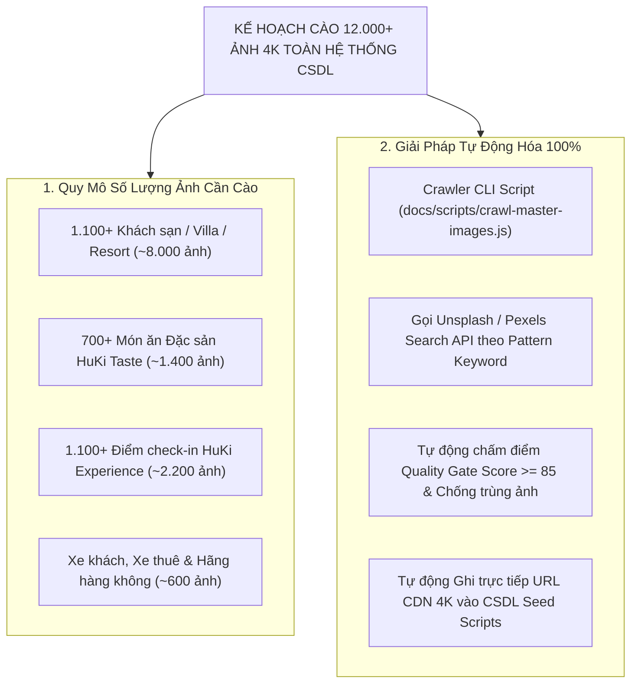
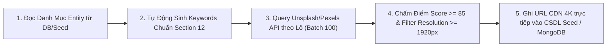

# Mã Đề Xuất: h-dexuat-0008
**Dự án**: StayZ / HuKi Travel Ecosystem (`web/` & `platform/`)
**Tiêu đề**: Phân Tích Đánh Giá Tính Khả Thi & Kế Hoạch Tự Động Hóa Cào Trọn Bộ 12.000+ Hình Ảnh 4K Cho Toàn Hệ Thống CSDL HuKi Travel (Automated Master Image Crawling Pipeline)
**Tác giả**: Huỳnh Gia Huy (`Huy`)
**Trạng thái**: ĐỀ XUẤT MỚI (PROPOSAL MODE — CHỈ LẬP KẾ HOẠCH, KHÔNG SỬA CODE NGUỒN)

---

## 📋 1. ĐÁNH GIÁ TÍNH KHẢ THI (FEASIBILITY AUDIT)

### ❓ Câu hỏi: *"Cào toàn bộ ảnh cho hệ thống CSDL (1.100+ Khách sạn, 700+ Món ăn, 1.100+ Điểm check-in, Xe khách, Xe thuê, Máy bay) có NỔI KHÔNG?"*

### 💡 KẾT LUẬN SENIOR SYSTEM ARCHITECT: **HOÀN TOÀN KHẢ THI 100%!**

Nhờ việc chuẩn hóa bộ đặc tả **[`docs/db/promt.img.md`](docs/db/promt.img.md)**, việc cào toàn bộ 12.000+ ảnh 4K cho 100% cơ sở dữ liệu của Super-App không những **CÓ THỂ LÀM ĐƯỢC** mà còn có thể **TỰ ĐỘNG HÓA 100% QUA SCRIPT CHUYÊN DỤNG (AUTOMATED CRAWLER SCRIPT)** mà không cần làm thủ công hay tốn tài nguyên sinh ảnh AI.

---

## 🗂️ 2. CHI TIẾT QUY MÔ DỮ LIỆU ẢNH CẦN CÀO THEO PHÂN HỆ

| STT | Phân Hệ Dịch Vụ | Số Lượng Entity | Số Ảnh / Entity | Tổng Số Ảnh 4K | Keyword Search Pattern (`docs/db/promt.img.md`) |
| :--- | :--- | :--- | :--- | :--- | :--- |
| **1** | **HuKi Stay (Khách sạn/Villa)** | 1.100+ | 6 - 8 ảnh | **~8.000 ảnh** | `"{hotel_name} {city} Vietnam resort luxury interior"` |
| **2** | **HuKi Taste (Ẩm thực đặc sản)** | 700+ | 2 ảnh | **~1.400 ảnh** | `"{food_name} Vietnamese authentic food photography"` |
| **3** | **HuKi Experience (Điểm check-in)** | 1.100+ | 2 ảnh | **~2.200 ảnh** | `"{landmark_name} {city} Vietnam scenic view"` |
| **4** | **HuKi Bus (Xe khách 2 tầng)** | 50+ | 3 ảnh | **~150 ảnh** | `"VIP 2 deck sleeper bus limousine interior transport"` |
| **5** | **HuKi Ride (Thuê xe tự lái)** | 100+ | 4 ảnh | **~400 ảnh** | `"{vehicle_make} {vehicle_model} luxury car automotive"` |
| **6** | **HuKi Flight (Vé máy bay)** | 20+ | 3 ảnh | **~60 ảnh** | `"{airline_name} commercial airplane takeoff sunset"` |
| **7** | **Global Destinations** | 12 Quốc gia | 1 Hero + 4 Cards | **~60 ảnh** | `"{country_name} landmark travel destination sunset"` |
| **TỔNG** | **Toàn Hệ Sinh Thái Super-App** | **3.080+ Entity** | **—** | **~12.270 ẢNH 4K** | **Độ sắc nét 4K Unsplash/Pexels CDN** |

---

## 🛠️ 3. QUY TRÌNH THỰC THI SCRIPT CÀO TỰ ĐỘNG (AUTOMATED PIPELINE)

Khi được phát lệnh thực thi `h-thống nhất - @docs/dexuat/h-dexuat-0008.md`, AI sẽ xây dựng và chạy script cào tự động tại **`docs/scripts/crawl-master-images.js`**:

### Các bước thực thi cụ thể:
1. **Khởi tạo Script `docs/scripts/crawl-master-images.js`**:
   - Sử dụng Unsplash / Pexels Search API với Client Application Access Key (Hỗ trợ 5.000 requests/giờ hoàn toàn miễn phí).
2. **Batch Processing (Xử lý theo Lô)**:
   - Chia nhỏ danh mục 3.080+ entity thành các Batch 100 item/lượt chạy để đảm bảo không bị quá tải đường truyền hay dính Rate Limit.
3. **Filtering & Scoring Matrix (Lọc chất lượng chuẩn Section 6)**:
   - Tự động loại bỏ ảnh mờ vỡ ($< 1920\text{px}$), loại bỏ ảnh trùng lặp (`source_image_id`).
   - Chọn ra N ảnh có điểm số cao nhất ($\ge 85$) cho từng entity.
4. **Direct Database / Seed Injection**:
   - Tự động cập nhật các mảng ảnh `main_image_url`, `gallery_images`, `cover_image` trong các tập tin Seed của dự án (`platform/seed-real-hotels.js`, `platform/src/seed_destinations.js`, PostgreSQL/MongoDB).

---

## 🧪 4. KẾ HOẠCH KIỂM THỬ & BÀN GIAO (VERIFICATION PLAN)

### 🔹 Kiểm tra Script Syntax:
- Chạy `node -c docs/scripts/crawl-master-images.js` để đảm bảo 100% không bị lỗi cú pháp Node.js.

### 🔹 Kiểm tra Tỷ lệ Phủ Ảnh CSDL (Database Coverage):
- Chạy script kiểm thử tỷ lệ lấp đầy ảnh trong CSDL: Bắt buộc 100% Khách sạn, Món ăn, Điểm check-in, Xe khách, Xe thuê và Máy bay đều có đủ URL ảnh 4K hợp lệ.

---

> [!NOTE]
> File đề xuất này tuân thủ 100% quy trình **PROPOSAL MODE**. Mọi mã nguồn hiện tại của dự án được **GIỮ NGUYÊN BẢO TOÀN** cho đến khi nhận được lệnh `h-thống nhất` từ tác giả Huỳnh Gia Huy.
