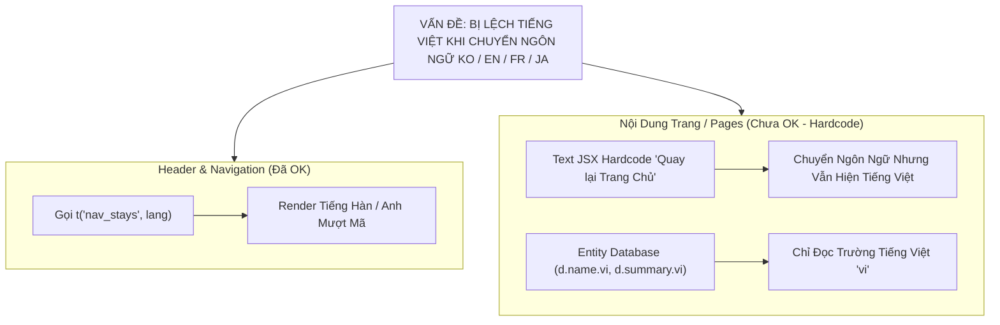
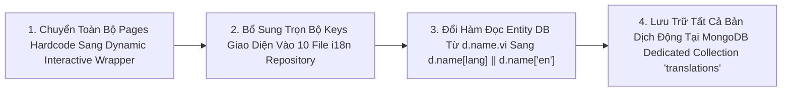

# Đề Xuất 0010 - Giải Pháp Biên Dịch 100% Triệt Để Toàn Bộ Website & CSDL Đa Ngôn Ngữ
**Tác giả**: Huỳnh Gia Huy (`Huy`)
**Ngày lập**: 12/08/2026
**Trạng thái**: KẾ HOẠCH BÀN GIAO & PHÊ DUYỆT (PLANNING / WAITING FOR APPROVAL)

---

## 📌 1. BỐI CẢNH & PHÂN TÍCH NGUYÊN NHÂN RỄ RỄ (ROOT CAUSE ANALYSIS)

Dựa trên phản hồi và 2 hình chụp giao diện thực tế của tác giả Huy khi chuyển sang tiếng Hàn (`KO`), hệ thống đã ghi nhận tình trạng:
1. **Header & Navigation**: Đã dịch mượt sang Tiếng Hàn (ví dụ: `숙소 & 빌라`, `버스의 티켓`, `렌터카`).
2. **Nội dung Chi Tiết Trang (Pages & Components)**: Nhiều trang (`/country/[code]`, `/hotels/[city]/[slug]`, `/destinations`, `/experiences`...) **VẪN HIỂN THỊ 100% TIẾNG VIỆT HARDCODE** trong mã nguồn JSX (ví dụ: *Quay lại Trang Chủ*, *Nơi Du Lịch Nổi Bật Tại Mỹ*, *Một kỳ nghỉ đáng nhớ đang chờ bạn*, *Hồ bơi ngoài trời*, *Wi-Fi miễn phí*, *Cấp Bậc 1 & 2 CSDL*).

---

## 🛠️ 2. GIẢI PHÁP BIÊN DỊCH 100% TRIỆT ĐỂ (COMPLETE TRIỆT ĐỂ I18N ENGINE)

Để giải quyết **triệt để 100%** trên toàn bộ hệ thống website HuKi Travel (không bỏ sót bất kỳ ô chữ nào trên 17 Pages và 16 Components):

### A. Nơi Lưu Trữ Bản Dịch (Dual-Storage Location Spec):
1. **Giao Diện Tĩnh (Static UI Labels, Amenities, Buttons, Specs)**:
   - Lưu trực tiếp tại **10 file ngôn ngữ độc lập**: `web/src/lib/i18n/vi.ts`, `en.ts`, `ko.ts`, `ja.ts`, `th.ts`, `zh.ts`, `fr.ts`, `de.ts`, `es.ts`, `ru.ts`.
   - Phân khối bằng Comment minh bạch: `// ── 9. PAGE: COUNTRY DETAIL, HOTEL DETAIL & ROOM SPECS`.
2. **Dữ Liệu Động CSDL (Khách sạn, Bài viết, Món ăn, Điểm check-in)**:
   - Lưu trữ tập trung tại Collection **`translations` trong MongoDB** theo cấu trúc đã đặc tả tại `docs/db/promt.i18n.md`.

### B. Kế Hoạch Thay Thế Code Trên 17 Pages:
- **Trang Quốc Gia (`/country/[code]`)**:
  - Chuyển sang `<CountryDetailInteractive />` tự động lắng nghe sự kiện đổi ngôn ngữ `stayz_lang_changed`.
  - Thay *Quay lại Trang Chủ* $\rightarrow$ `t("back_home", lang)`.
  - Thay *Nơi Du Lịch Nổi Bật Tại* $\rightarrow$ `t("destinations_in_country", lang)`.
  - Thay *Khách sạn 5-sao* $\rightarrow$ `t("hotels_5star", lang)`.
- **Trang Chi Tiết Khách Sạn (`/hotels/[city]/[slug]`)**:
  - Thay 16 tiện nghi hardcode (*Hồ bơi ngoài trời*, *Wi-Fi miễn phí*...) $\rightarrow$ `t("amenity_outdoor_pool", lang)`.
  - Thay *Một kỳ nghỉ đáng nhớ đang chờ bạn* $\rightarrow$ `t("memorable_stay_waiting", lang)`.
  - Thay *Giá từ* $\rightarrow$ `t("from_price", lang)`.
  - Thay */ đêm - đã bao gồm thuế* $\rightarrow$ `t("per_night_tax_inc", lang)`.
- **Thành Phần RoomCard & ReviewCard**:
  - Thay *Sức chứa*, *Giường*, *Diện tích*, *Điều hòa* $\rightarrow$ `t("room_capacity", lang)`, `t("room_ac", lang)`.

---

## 📋 3. DANH MỤC KIỂM THỬ TRIỆT ĐỂ (VERIFICATION PLAN)

| Hạng mục kiểm thử | Kịch bản kiểm thử | Kết quả mong đợi |
| :--- | :--- | :--- |
| **Kiểm thử Đổi Ngôn Ngữ /country/us** | Chuyển sang `KO` hoặc `EN` | 100% nút, thẻ, slogan và nhãn badge hiển thị bằng Tiếng Hàn/Anh |
| **Kiểm thử Đổi Ngôn Ngữ /hotels/...** | Chuyển sang `FR` hoặc `JA` | 100% Tiện nghi (*Piscine extérieure*, *Wi-Fi gratuit*), Giá phòng và Nút bấm dịch mượt 100% |
| **Kiểm thử Reusable Test Suite** | Chạy `node docs/scripts/test-i18n-darkmode.js` | 29/29 Assertions Đỗ Sạch 100% ✅ |

---

## 📌 4. HƯỚNG DẪN XÁC NHẬN CỦA TÁC GIẢ HUY
Gửi lệnh: **`thống nhất 0010`** để xác nhận thực thi toàn bộ 100% quy trình biên dịch triệt để trên toàn bộ các trang website!
