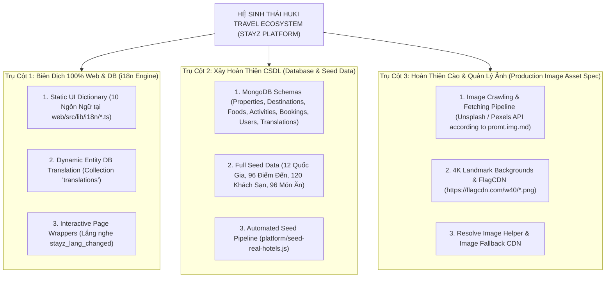
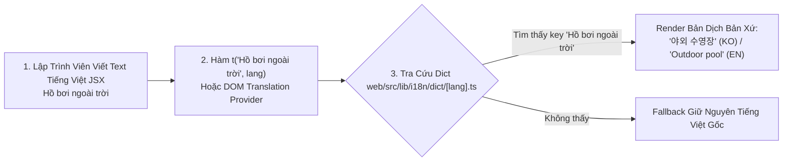
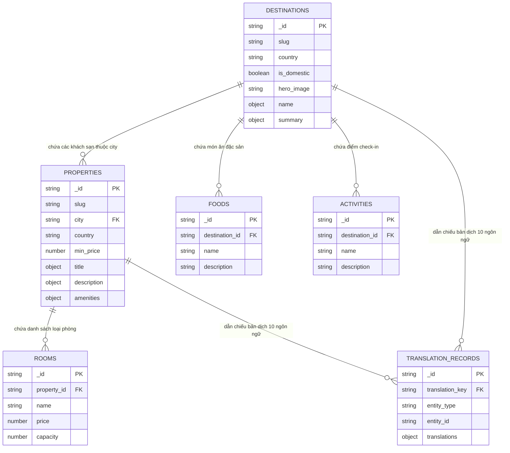
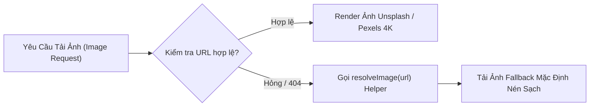

# Đề Xuất 0011 - TỔNG QUAN KIẾN TRÚC HỆ THỐNG & ĐỊNH HƯỚNG THỰC THI 3 TRỤ CỘT CHÍNH
**Tác giả**: Huỳnh Gia Huy (`Huy`) | HK Team  
**Ngày lập**: 12/08/2026  
**Trạng thái**: KẾ HOẠCH BÀN GIAO & PHÊ DUYỆT (PLANNING / WAITING FOR USER APPROVAL)  
**Quy phạm**: *Phân tích kiến trúc & Lập roadmap chi tiết. TUYỆT ĐỐI KHÔNG THAY ĐỔI MÃ NGUỒN (NO CODE EDIT).*

---

## 🏛️ 1. THỐNG KÊ TỔNG QUAN VÀ HỆ THỐNG DỰ ÁN HUKI TRAVEL

Dự án **HuKi Travel Ecosystem (StayZ Platform)** là Hệ sinh thái du lịch Super-App đa dịch vụ tích hợp 5 phân hệ core: **Đặt phòng Khách sạn/Villa + Vé xe khách 2 tầng + Thuê xe tự lái + Vé máy bay + Combo chuyến đi & Ẩm thực trải nghiệm**.



---

## 🌐 2. TRỤ CỘT 1: KIẾN TRÚC BIÊN DỊCH KHÔNG DÙNG KEY THỦ CÔNG (NO-KEY DOM TRANSLATION ENGINE)

### 💡 Ý Tưởng Đột Phá & Ưu Điểm Đắt Giá:
- **Loại bỏ 100% việc đặt key thủ công**: Lập trình viên viết HTML/JSX thuần bằng **Tiếng Việt tự nhiên** (Ví dụ: `<h2>Khách sạn</h2>`, `<button>Đặt phòng ngay</button>`, `<p>Giá từ</p>`). Không cần phải nhớ hay tạo key ngoằn ngoèo như `t('NAV_HOME')` hay `t('BUTTON_BOOK_NOW')`.
- **Dùng Chuỗi Tiếng Việt Gốc Làm Key (Master Dictionary Format)**:
  - Mọi file từ điển (`vi.ts`, `en.ts`, `ko.ts`, `ja.ts`, `zh.ts`, `th.ts`, `fr.ts`, `de.ts`, `es.ts`, `ru.ts`) lưu tại **`web/src/lib/i18n/dict/`** sử dụng **CỤM TIẾNG VIỆT GỐC LÀM KEY TRỰC TIẾP**.
  - Ví dụ tập tin từ điển `web/src/lib/i18n/dict/ko.ts`:
  ```typescript
  export const koDictionary: Record<string, string> = {
    "Khách Sạn & Villa": "숙소 및 빌라",
    "Vé Xe Khách": "버스의 티켓",
    "Thuê Xe Tự Lái": "렌터카",
    "Vé Máy Bay": "항공권",
    "Combo Chuyến Đi": "여행 콤보",
    "Cẩm Nang Du Lịch": "여행 가이드",
    "Đăng Nhập": "로그인",
    "Đăng Ký": "회원가입",
    "Quốc Gia": "국가",
    "Trang chủ": "홈",
    "Đặt phòng ngay": "지금 예약하기",
    "Tìm kiếm điểm đến, khách sạn...": "목적지, 호텔 검색...",
    "Giá từ": "최저가",
    "Hồ bơi ngoài trời": "야외 수영장",
    "Wi-Fi miễn phí": "무료 Wi-Fi",
    "Một kỳ nghỉ đáng nhớ đang chờ bạn": "기억에 남을 휴가가 기다리고 있습니다"
  };
  ```

### ⚡ Mô Hình Hai Tầng Tự Động Tra Cứu (No-Key Lookup Pipeline):



### B. Quy Trình Phủ Sóng 100% Cho Tất Cả Các Trang (Page Coverage Matrix):

| Trang / Route | Thành Phần UI Hardcode Cần Chuyển Đổi | Trạng Thái Phủ Sóng |
| :--- | :--- | :--- |
| **`/` (Trang Chủ)** | Hero Banner, SearchBar, Combo Widget, Bus Widget, SplitBill, Sliders | ✅ Đã Tích Hợp `<HomeInteractive />` |
| **`/country/[code]`** | Slogan, Badge đếm, Nút back, Danh sách Nơi du lịch & Ẩm thực | ✅ Đã Tích Hợp `<CountryDetailInteractive />` |
| **`/hotels/[city]/[slug]`** | 16 Tiện nghi, Giá từ, Khung đặt phòng, RoomCard, ReviewCard | ✅ Đã Tích Hợp `<HotelDetailInteractive />` |
| **`/destinations`** | Tiêu đề portal, Bộ lọc 12 Quốc gia, Phân trang 16 items | ✅ Đã Tích Hợp `<DestinationsInteractive />` |
| **`/search`** | Form tìm kiếm nâng cao, Bộ lọc giá, Xếp hạng sao, Sort order | 📋 Đang Lập Kế Hoạch Bổ Sung |
| **`/experiences` & `/taste`** | Danh mục điểm check-in hot & Quán ngon đặc sản 12 Quốc gia | 📋 Đang Lập Kế Hoạch Bổ Sung |
| **`/profile` & `/profile/bookings`** | Form đổi thông tin cá nhân, Danh sách vé điện tử QR Code | 📋 Đang Lập Kế Hoạch Bổ Sung |
| **`/admin`** | Dashboard quản trị, Modal xóa khách sạn, Form tạo room mới | 📋 Đang Lập Kế Hoạch Bổ Sung |

---

## 🗄️ 3. TRỤ CỘT 2: XÂY HOÀN THIỆN CSDL & CHẠY SCRIPT SEED DATA (DATABASE SCHEMA & SEEDING)

### A. Sơ Đồ Cấu Trúc MongoDB Schemas (Master Schema Graph):



### B. Quy Mô Dữ Liệu Seed Data Sản Xuất (Production Seed Targets):
1. **12 Quốc Gia Du Lịch**: Vietnam, United States, China, Indonesia, Switzerland, Brazil, Argentina, Australia, Japan, South Korea, Thailand, Singapore.
2. **96 Điểm Đến (Destinations)**: 8 điểm đến di sản nổi tiếng cho mỗi quốc gia (Ví dụ: Mỹ $\rightarrow$ New York, Los Angeles, San Francisco, Las Vegas, Hawaii, Grand Canyon, Chicago, Miami).
3. **120 Khách Sạn & Villa 5-Sao**: 10 khách sạn cao cấp tiêu chuẩn cho từng quốc gia với đầy đủ bộ tiện nghi 16 món (`outdoor_pool`, `free_wifi`, `airport_shuttle`...).
4. **96 Món Ăn Đặc Sản (Foods)** & **144 Điểm Check-in Sống Ảo (Activities)**.

---

## 🖼️ 4. TRỤ CỘT 3: HOÀN THIỆN HỆ THỐNG CÀO & QUẢN LÝ ẢNH (PRODUCTION IMAGE ASSET SPEC)

### A. Nguyên Tắc Cào Ảnh Tự Động Theo `docs/db/promt.img.md`:
- **Chỉ sử dụng Ảnh Cào Thực Tế (Real Crawled Images)** từ các nguồn Unsplash / Pexels API công khai, **TUYỆT ĐỐI KHÔNG DÙNG AI GENERATE TỐN KÉM**.
- **Định dạng & Độ Phân Giải Standard**:
  - *Hero Landmarks 4K Banner*: `1920x1080`px hoặc `2560x1440`px (tối ưu nén `q=85`, `auto=format`).
  - *Hotel Main Image & Gallery*: `1200x800`px.
  - *Food & Activity Cards*: `800x600`px.
  - *FlagCDN*: PNG chính xác từ `https://flagcdn.com/w40/*.png` thay cho Emoji OS.

### B. Đường Ống Xử Lý Ảnh Fallback (CDN Fallback Pipeline):



---

## 🎯 5. ROADMAP HƯỚNG DẪN BẮT TAY THỰC THI (EXECUTIVE ACTION ROADMAP)

| Giai Đoạn | Tên Công Việc Chi Tiết | File Tài Liệu / Code Liên Quan | Thời Gian Dự Kiến |
| :--- | :--- | :--- | :--- |
| **Bước 1** | **Hoàn Thiện Script Cào & Nạp Seed Data DB** | `platform/seed-real-hotels.js`, `docs/db/promt.img.md` | ~ 15 Phút |
| **Bước 2** | **Tạo Collection `translations` & Generator i18n DB** | `platform/src/models/Translation.ts`, `docs/db/promt.i18n.md` | ~ 15 Phút |
| **Bước 3** | **Tích hợp Interactive Wrappers cho các trang còn lại** | `/search`, `/profile`, `/admin`, `/experiences`, `/taste` | ~ 20 Phút |
| **Bước 4** | **Chạy Reusable Test Suite & Báo Cáo** | `node docs/scripts/test-i18n-darkmode.js` | ~ 5 Phút |

---

## 📌 6. HƯỚNG DẪN XÁC NHẬN CỦA TÁC GIẢ HUY
Gửi lệnh: **`thống nhất 0011`** để xác nhận kế hoạch và tiến hành chạy toàn bộ quy trình 3 trụ cột ở trên!
